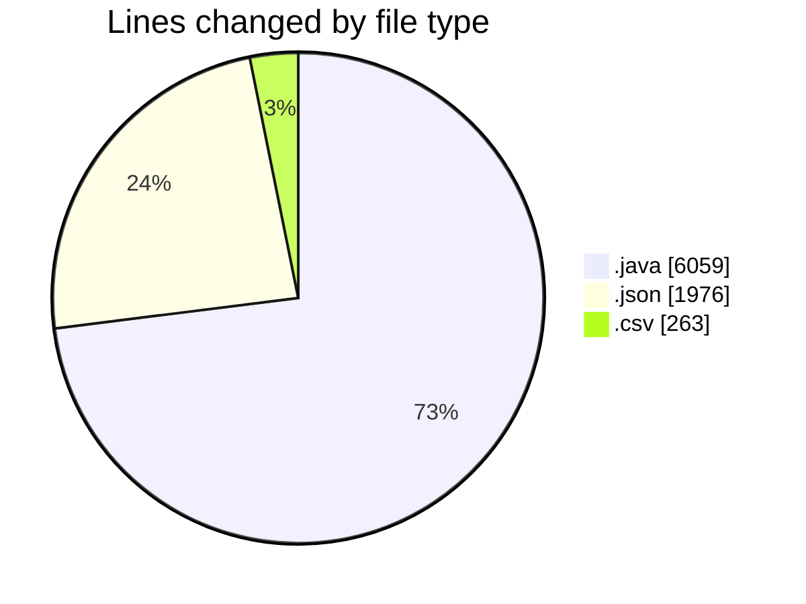
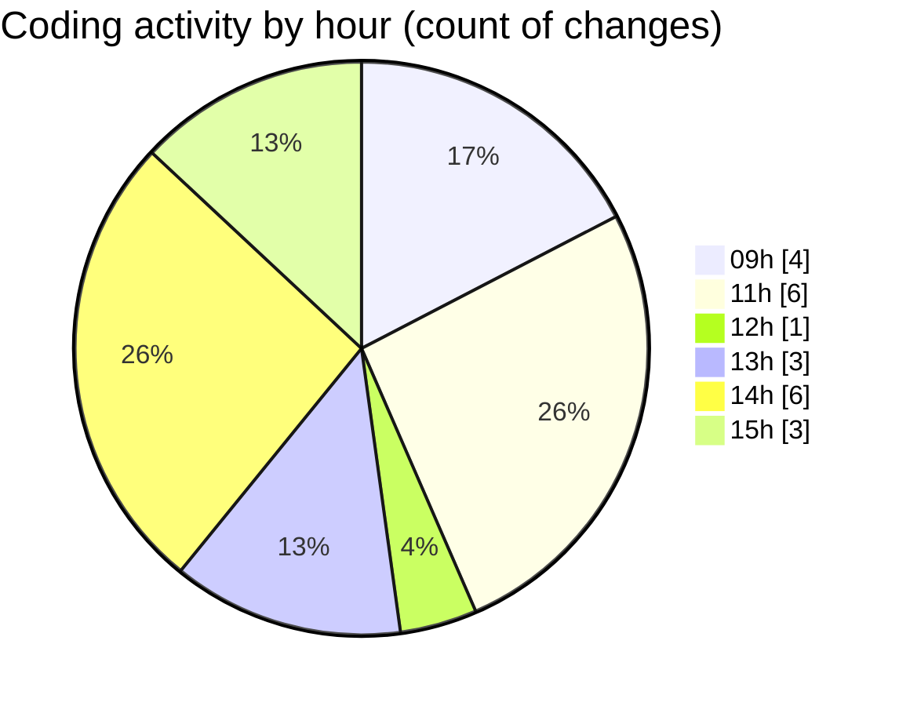

# CILApp - Activity Summary 

## Overall Statistics

| Stat                   | Value                                                             |
| ---------------------- | ----------------------------------------------------------------- |
| **Lines Added** (➕)   | 8282                                          |
| **Lines Removed** (➖) | 16                                        |
| **Net Change** (↕)    | 8266                |
| **Active Time** (⌚)   | 18 minutes |

## Modified Files
- **ProcMonitorioToMASC.java** (+1363, -4)
- **launch.json** (+1759, -1)
- **SMS_MASC_DATA_20260123121818.csv** (+263, -0)
- **settings.json** (+216, -0)
- **PanelMantExpedientes.java** (+3921, -0)
- **MascSmsService.java** (+760, -11)

## Visualizations

### By File Type (Lines Changed)

### By Hour (Estimated Activity Count)

> **Last Updated:** 2/24/2026, 3:07:05 PM