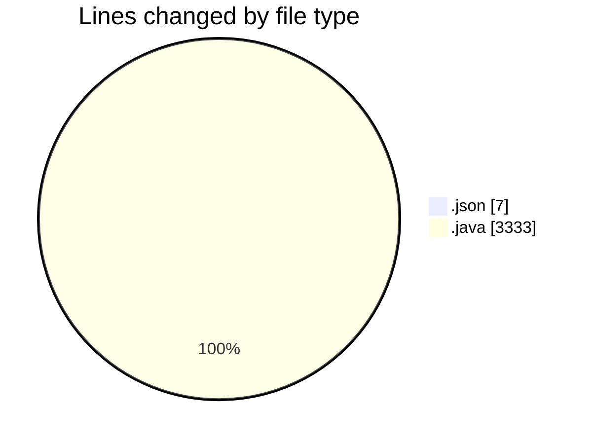
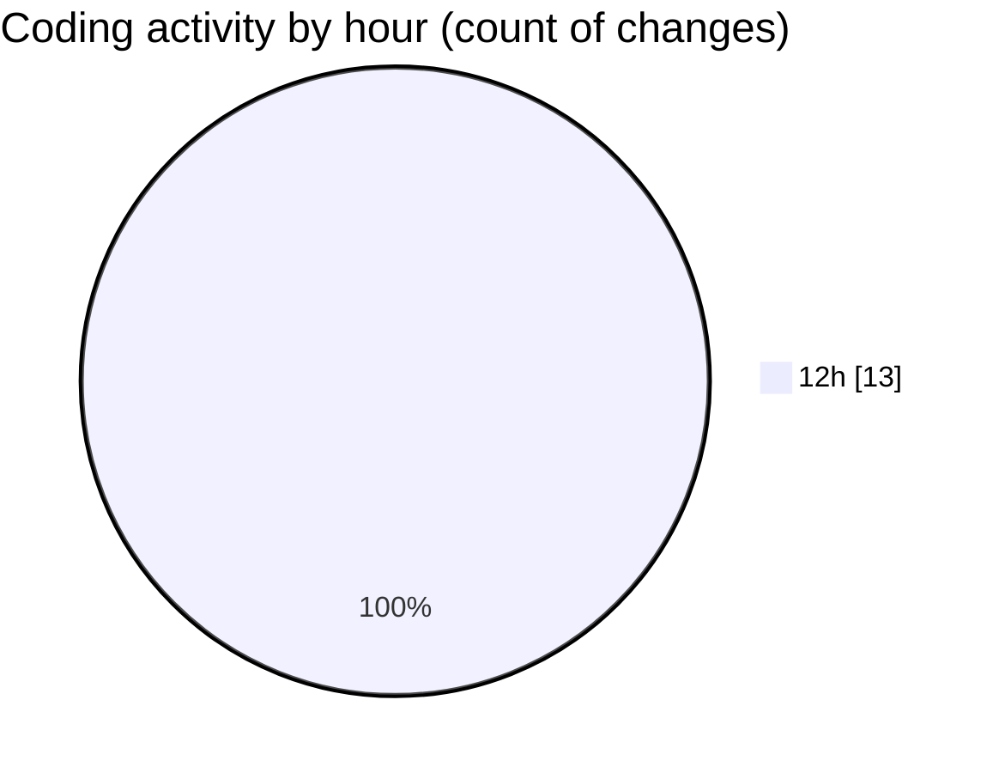

# CILApp - Activity Summary 

## Overall Statistics

| Stat                   | Value                                                             |
| ---------------------- | ----------------------------------------------------------------- |
| **Lines Added** (➕)   | 3332                                          |
| **Lines Removed** (➖) | 8                                        |
| **Net Change** (↕)    | 3324                |
| **Active Time** (⌚)   | 9 minutes |

## Modified Files
- **settings.json** (+7, -0)
- **AsignacionProcurador.java** (+404, -0)
- **ProcMonitorioToMASC.java** (+0, -6)
- **MascSmsService.java** (+0, -2)
- **PanelGestionRecobro.java** (+2921, -0)

## Visualizations

### By File Type (Lines Changed)

### By Hour (Estimated Activity Count)

> **Last Updated:** 2/25/2026, 12:36:34 PM