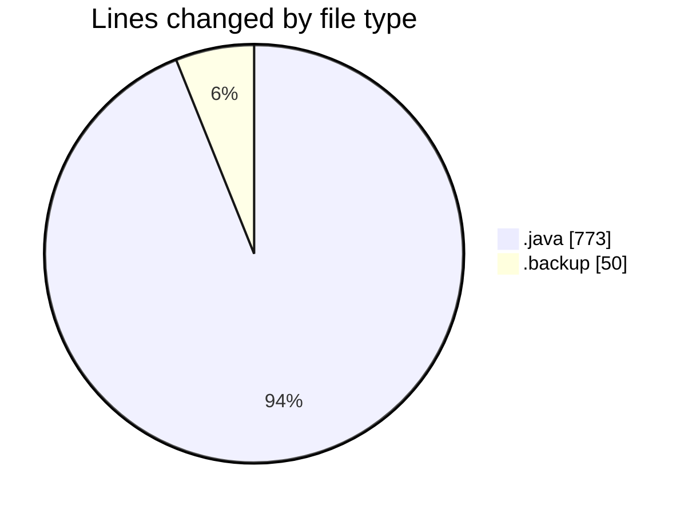
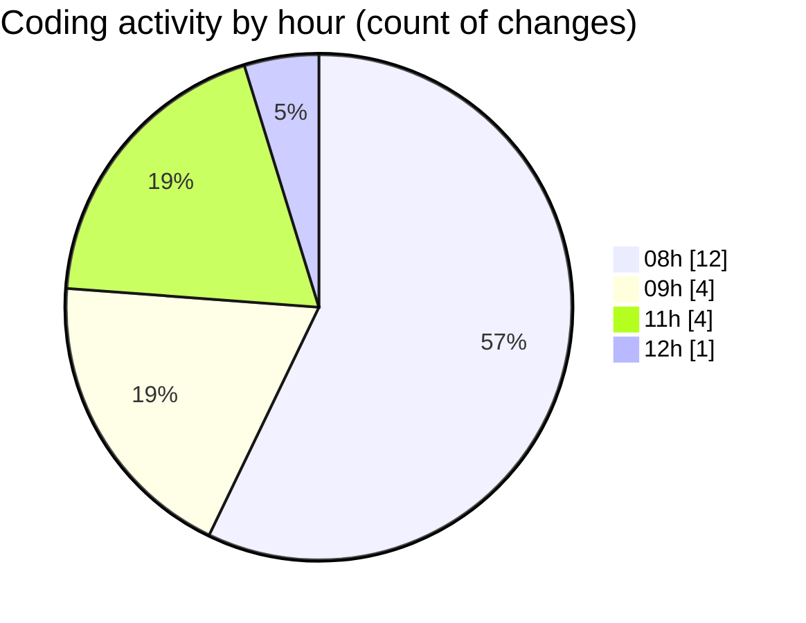

# CILApp - Activity Summary 

## Overall Statistics

| Stat                   | Value                                                             |
| ---------------------- | ----------------------------------------------------------------- |
| **Lines Added** (➕)   | 802                                          |
| **Lines Removed** (➖) | 21                                        |
| **Net Change** (↕)    | 781                |
| **Active Time** (⌚)   | 30 minutes |

## Modified Files
- **GrupoPdfMasc.java** (+1, -0)
- **PresentacionMonitorios.java** (+284, -18)
- **MascSmsService.java** (+114, -3)
- **PanelMonitoriosPtesImpresion.java** (+353, -0)
- **cartas_resto_2026-02-26_1.backup** (+50, -0)

## Visualizations

### By File Type (Lines Changed)

### By Hour (Estimated Activity Count)

> **Last Updated:** 2/26/2026, 12:30:18 PM