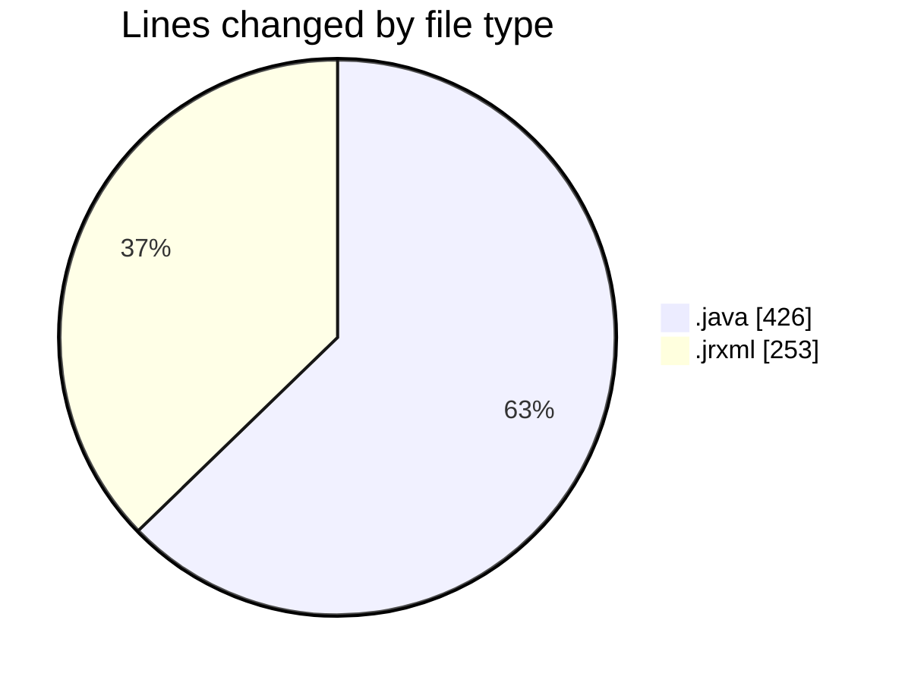
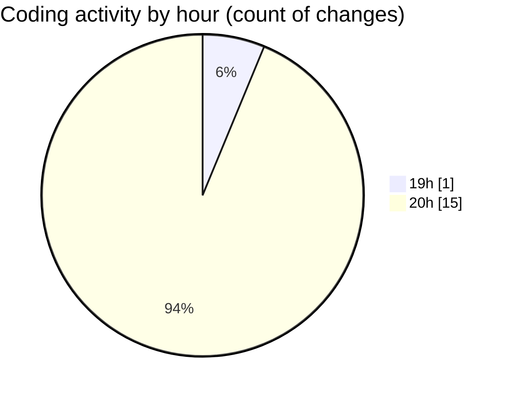

# CILReports (Workspace) - Activity Summary 

## Overall Statistics

| Stat                   | Value                                                             |
| ---------------------- | ----------------------------------------------------------------- |
| **Lines Added** (➕)   | 615                                          |
| **Lines Removed** (➖) | 64                                        |
| **Net Change** (↕)    | 551                |
| **Active Time** (⌚)   | 28 minutes |

## Modified Files
- **JasperAsesoriaRestController.java** (+69, -0)
- **JasperAsesoriaService.java** (+24, -0)
- **JasperAsesoriaServiceImp.java** (+306, -9)
- **ConstantsJasperAsesoria.java** (+18, -0)
- **MON_AGRU_2.jrxml** (+99, -46)
- **MON_AGRU.jrxml** (+99, -9)

## Visualizations

### By File Type (Lines Changed)

### By Hour (Estimated Activity Count)

> **Last Updated:** 3/1/2026, 8:33:32 PM