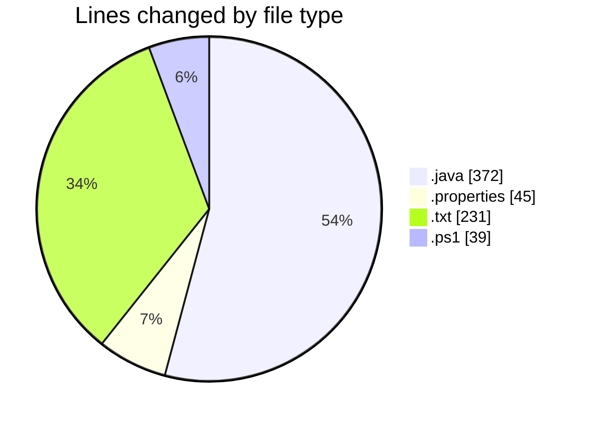
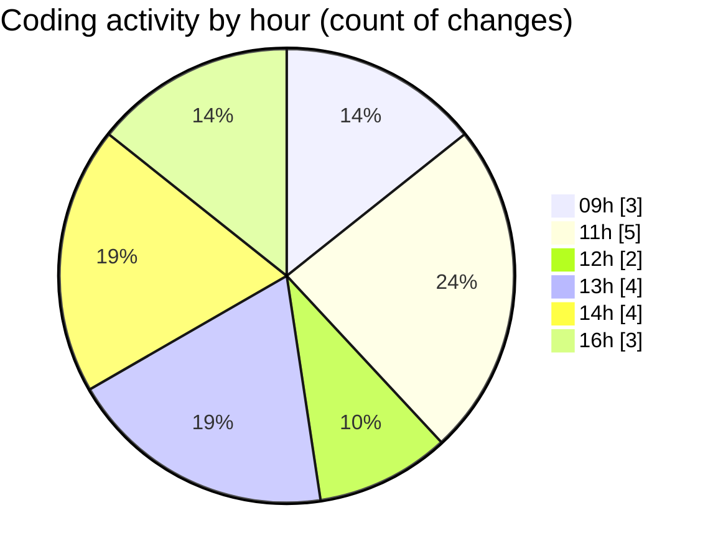

# CILApp - Activity Summary 

## Overall Statistics

| Stat                   | Value                                                             |
| ---------------------- | ----------------------------------------------------------------- |
| **Lines Added** (➕)   | 406                                          |
| **Lines Removed** (➖) | 281                                        |
| **Net Change** (↕)    | 125                |
| **Active Time** (⌚)   | 18 minutes |

## Modified Files
- **PresentacionMonitorios.java** (+104, -268)
- **log4j.properties** (+32, -13)
- **mis_commits_20260303.txt** (+130, -0)
- **extraer_mis_commits.ps1** (+39, -0)
- **mis_commits_2_20260303.txt** (+101, -0)

## Visualizations

### By File Type (Lines Changed)

### By Hour (Estimated Activity Count)

> **Last Updated:** 3/3/2026, 4:13:06 PM