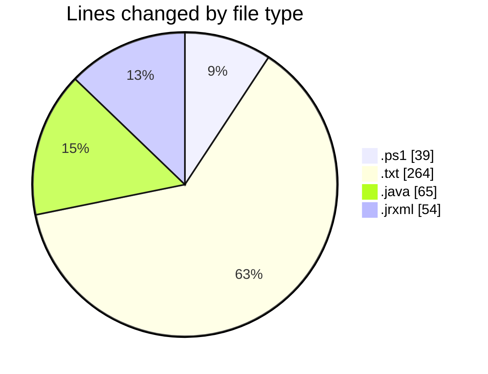
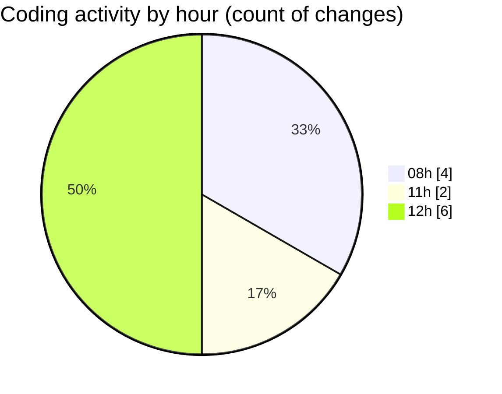

# CILReports (Workspace) - Activity Summary 

## Overall Statistics

| Stat                   | Value                                                             |
| ---------------------- | ----------------------------------------------------------------- |
| **Lines Added** (➕)   | 393                                          |
| **Lines Removed** (➖) | 29                                        |
| **Net Change** (↕)    | 364                |
| **Active Time** (⌚)   | 15 minutes |

## Modified Files
- **extraer_mis_commits.ps1** (+39, -0)
- **mis_commits_20260303.txt** (+130, -0)
- **mis_commits_220260303.txt** (+134, -0)
- **CilJasperReportApplication.java** (+54, -0)
- **JasperAsesoriaServiceImp.java** (+9, -2)
- **MON_AGRU.jrxml** (+27, -27)

## Visualizations

### By File Type (Lines Changed)

### By Hour (Estimated Activity Count)

> **Last Updated:** 3/3/2026, 12:43:08 PM