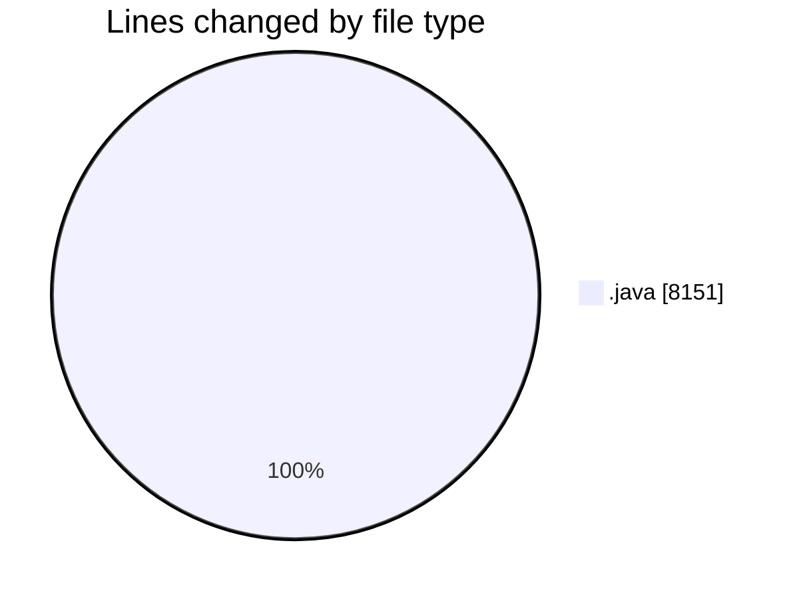

# CILApp - Activity Summary 

## Overall Statistics

| Stat                   | Value                                                             |
| ---------------------- | ----------------------------------------------------------------- |
| **Lines Added** (➕)   | 5273                                          |
| **Lines Removed** (➖) | 2878                                        |
| **Net Change** (↕)    | 2395                |
| **Active Time** (⌚)   | 13 minutes |

## Modified Files
- **PresentacionMonitorios.java** (+548, -1096)
- **AsignacionProcurador.java** (+18, -36)
- **Utilidades.java** (+3510, -0)
- **MascSmsService.java** (+589, -1178)
- **ProcMonitorioToMASC.java** (+284, -568)
- **EssendexCertComponentWrapper.java** (+324, -0)

## Visualizations

### By File Type (Lines Changed)

### By Hour (Estimated Activity Count)

> **Last Updated:** 3/4/2026, 3:34:02 PM