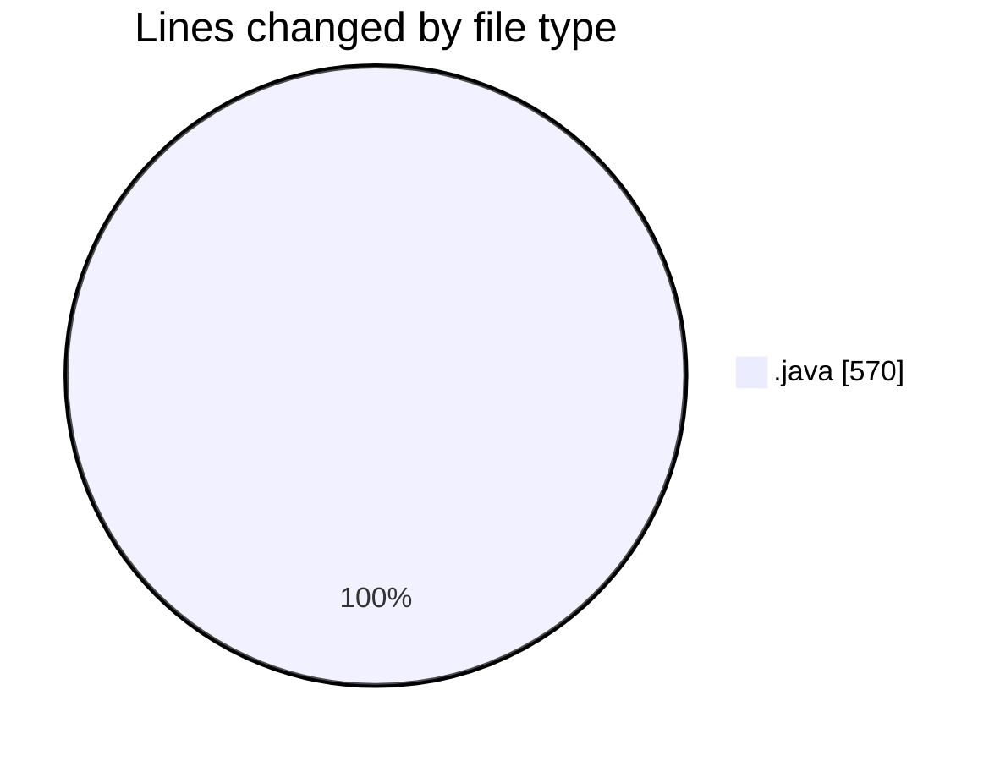
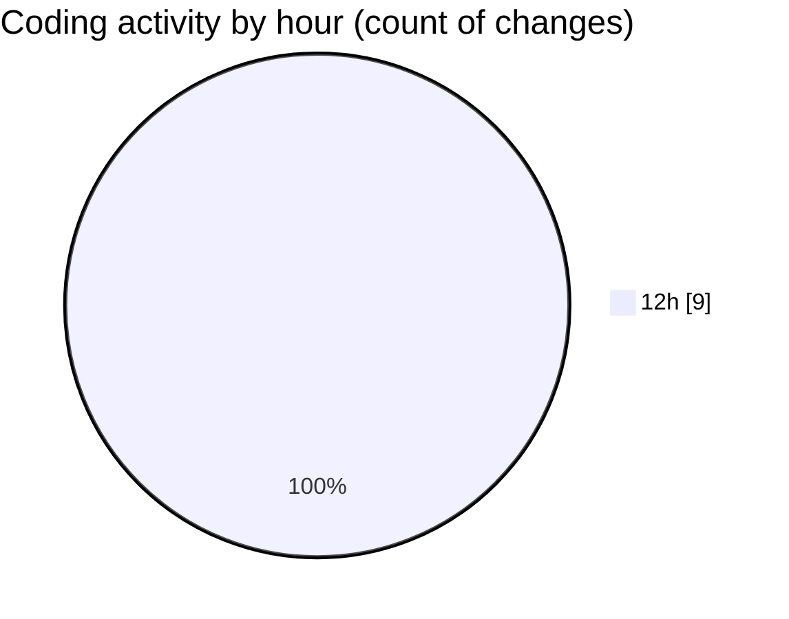

# CILReports (Workspace) - Activity Summary 

## Overall Statistics

| Stat                   | Value                                                             |
| ---------------------- | ----------------------------------------------------------------- |
| **Lines Added** (➕)   | 411                                          |
| **Lines Removed** (➖) | 159                                        |
| **Net Change** (↕)    | 252                |
| **Active Time** (⌚)   | 8 minutes |

## Modified Files
- **ConstantsJasperAsesoria.java** (+2, -2)
- **JasperAsesoriaServiceImp.java** (+133, -133)
- **JasperAsesoriaService.java** (+4, -4)
- **JasperAsesoriaRestController.java** (+20, -20)
- **JasperCobrosRepository.java** (+252, -0)

## Visualizations

### By File Type (Lines Changed)

### By Hour (Estimated Activity Count)

> **Last Updated:** 3/4/2026, 12:14:04 PM