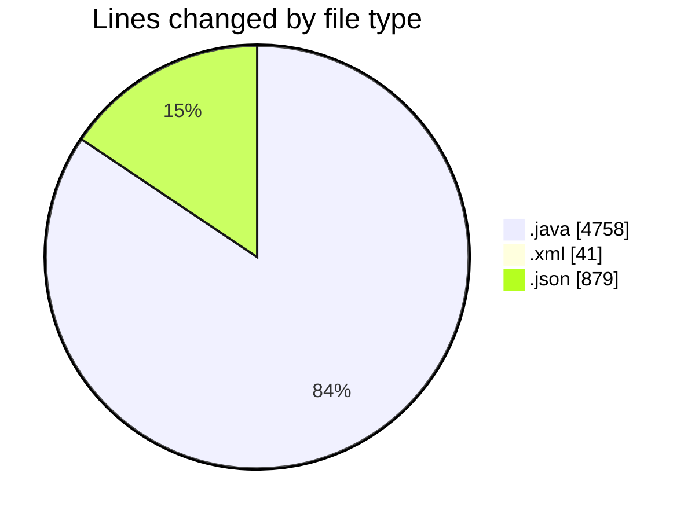
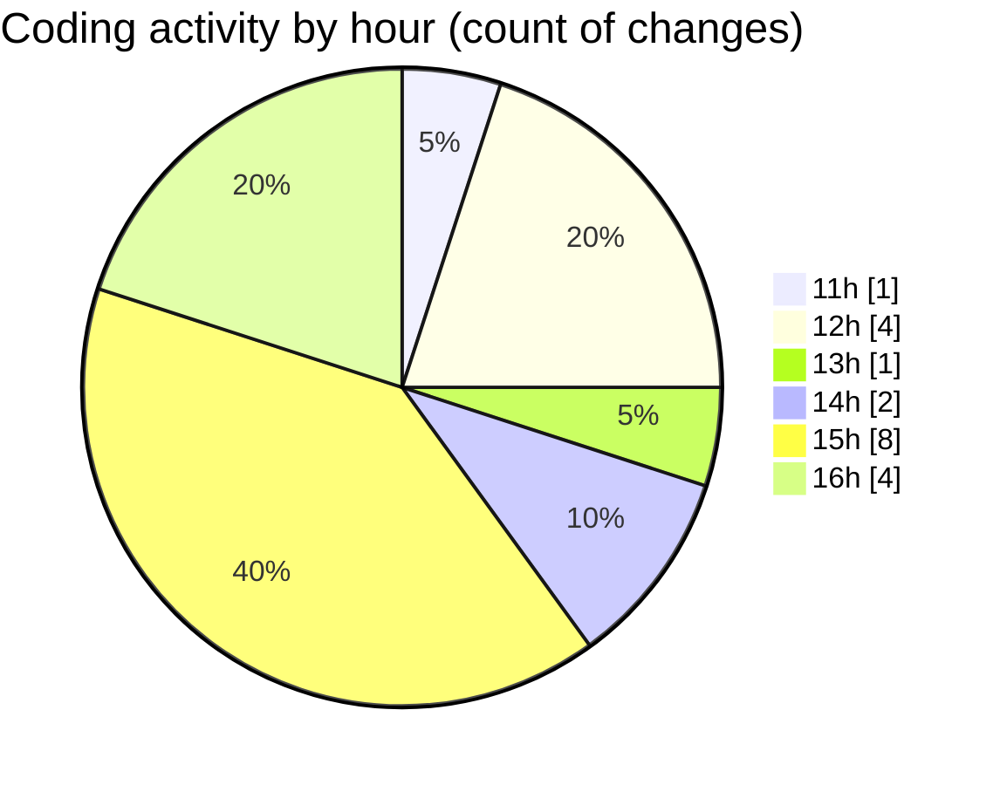

# CILApp - Activity Summary 

## Overall Statistics

| Stat                   | Value                                                             |
| ---------------------- | ----------------------------------------------------------------- |
| **Lines Added** (➕)   | 5634                                          |
| **Lines Removed** (➖) | 44                                        |
| **Net Change** (↕)    | 5590                |
| **Active Time** (⌚)   | 19 minutes |

## Modified Files
- **PanelCpPedidosMP.java** (+2651, -7)
- **pom.xml** (+41, -0)
- **MascSmsService.java** (+1054, -37)
- **launch.json** (+879, -0)
- **ProcMonitorioToMASC.java** (+685, -0)
- **EssendexCertComponentWrapper.java** (+324, -0)

## Visualizations

### By File Type (Lines Changed)

### By Hour (Estimated Activity Count)

> **Last Updated:** 3/10/2026, 4:21:46 PM