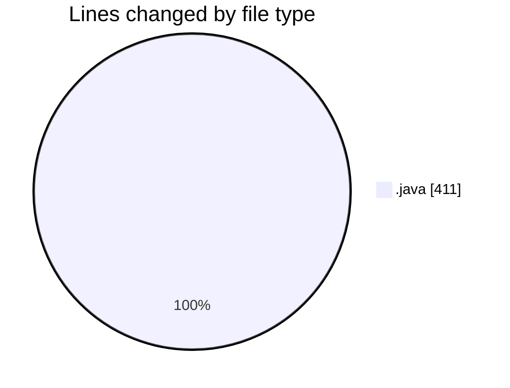
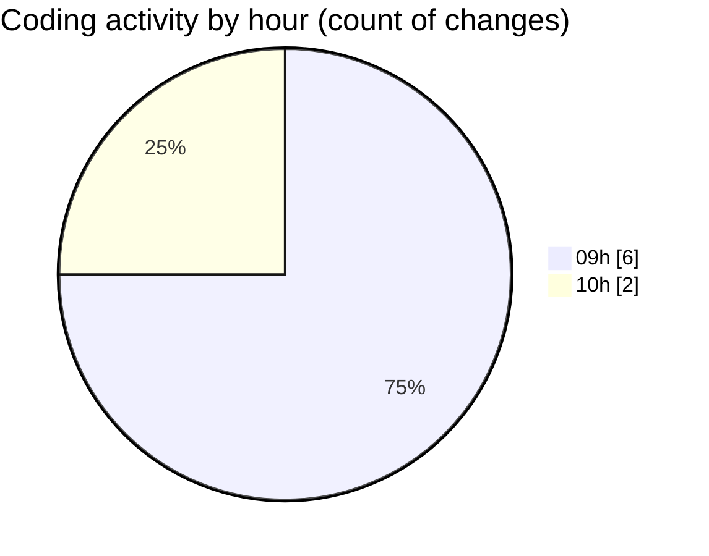

# CILReports (Workspace) - Activity Summary 

## Overall Statistics

| Stat                   | Value                                                             |
| ---------------------- | ----------------------------------------------------------------- |
| **Lines Added** (➕)   | 138                                          |
| **Lines Removed** (➖) | 273                                        |
| **Net Change** (↕)    | -135                |
| **Active Time** (⌚)   | 7 minutes |

## Modified Files
- **JasperComprasServiceImpl.java** (+0, -14)
- **JasperAsesoriaService.java** (+4, -4)
- **ConstantsJasperAsesoria.java** (+2, -2)
- **JasperRecoverRestController.java** (+132, -0)
- **JasperCobrosRepository.java** (+0, -253)

## Visualizations

### By File Type (Lines Changed)

### By Hour (Estimated Activity Count)

> **Last Updated:** 3/11/2026, 10:03:27 AM