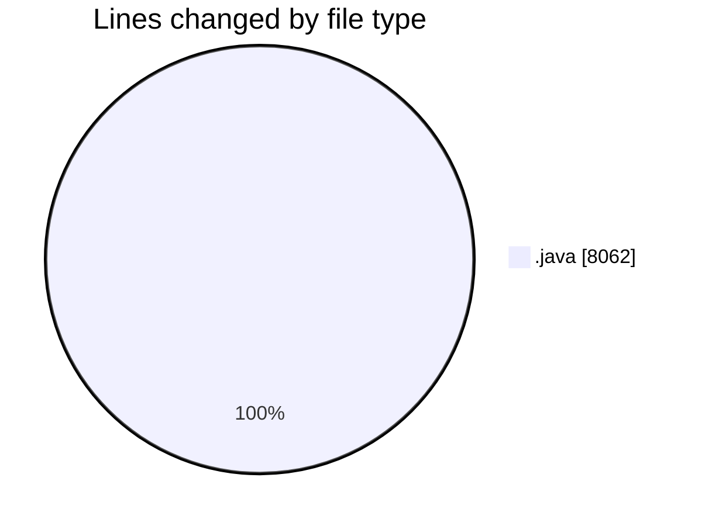
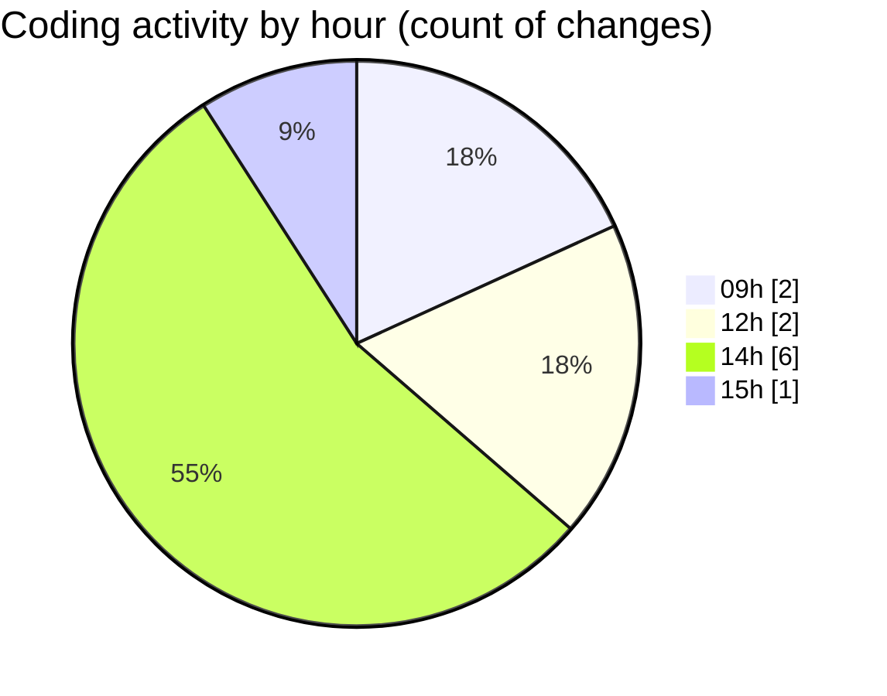

# CILApp - Activity Summary 

## Overall Statistics

| Stat                   | Value                                                             |
| ---------------------- | ----------------------------------------------------------------- |
| **Lines Added** (➕)   | 7147                                          |
| **Lines Removed** (➖) | 915                                        |
| **Net Change** (↕)    | 6232                |
| **Active Time** (⌚)   | 13 minutes |

## Modified Files
- **MascSmsService.java** (+0, -620)
- **ProcMonitorioToMASC.java** (+0, -284)
- **OfertasComerciales.java** (+949, -1)
- **PresentacionMonitorios.java** (+3463, -0)
- **PanelCpPedidosMP.java** (+2735, -10)

## Visualizations

### By File Type (Lines Changed)

### By Hour (Estimated Activity Count)

> **Last Updated:** 3/12/2026, 3:00:23 PM