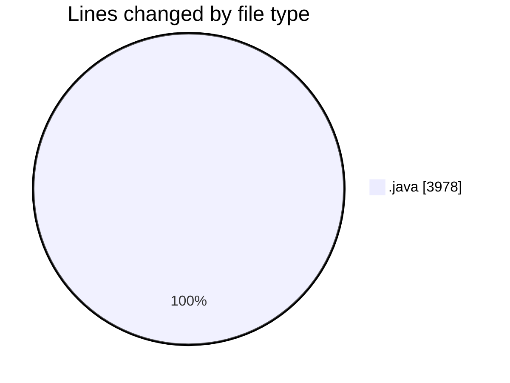
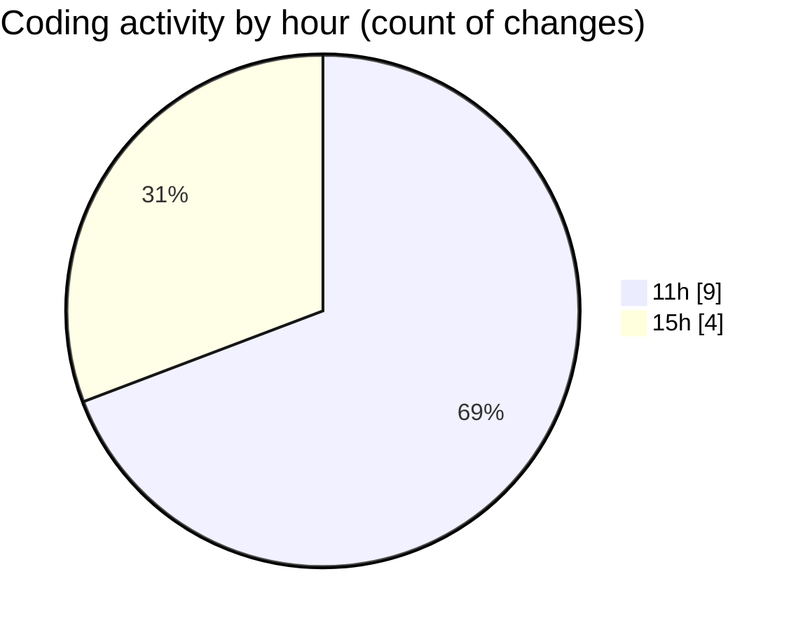

# CILApp - Activity Summary 

## Overall Statistics

| Stat                   | Value                                                             |
| ---------------------- | ----------------------------------------------------------------- |
| **Lines Added** (➕)   | 2834                                          |
| **Lines Removed** (➖) | 1144                                        |
| **Net Change** (↕)    | 1690                |
| **Active Time** (⌚)   | 5 minutes |

## Modified Files
- **ConstantesNotif.java** (+58, -1)
- **MascSmsService.java** (+1522, -573)
- **OfertasComerciales.java** (+23, -24)
- **PresentacionMonitorios.java** (+546, -546)
- **ProcMonitorioToMASC.java** (+685, -0)

## Visualizations

### By File Type (Lines Changed)

### By Hour (Estimated Activity Count)

> **Last Updated:** 3/23/2026, 3:30:34 PM