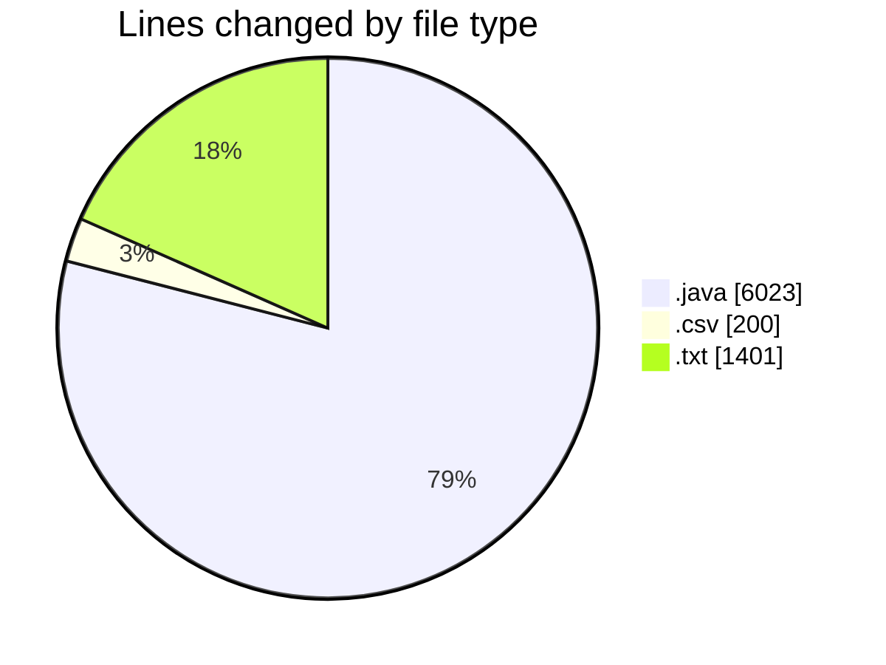
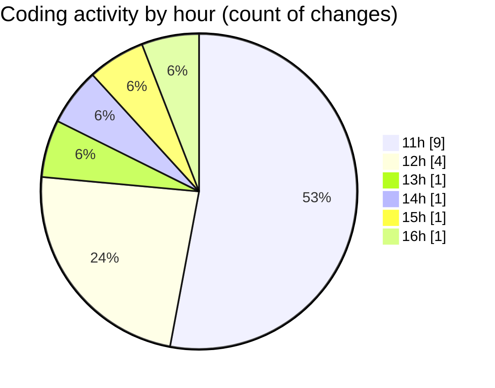

# CILApp - Activity Summary 

## Overall Statistics

| Stat                   | Value                                                             |
| ---------------------- | ----------------------------------------------------------------- |
| **Lines Added** (➕)   | 6149                                          |
| **Lines Removed** (➖) | 1475                                        |
| **Net Change** (↕)    | 4674                |
| **Active Time** (⌚)   | 14 minutes |

## Modified Files
- **ProcMonitorioToMASC.java** (+0, -297)
- **PresentacionMonitorios.java** (+0, -546)
- **OfertasComerciales.java** (+0, -23)
- **MascSmsService.java** (+0, -573)
- **AccessMetadataToCSV.java** (+162, -36)
- **tabla_metadata_copia-24_03_2026.csv** (+157, -0)
- **METADATA CILOWNER TABLAS-VIEWS AJT%-AJV%.txt** (+1401, -0)
- **mapeo_access_to_db2_ori.csv** (+43, -0)
- **insertaAsesoria.java** (+2158, -0)
- **FicherosAgenciasRecobro.java** (+2053, -0)
- **AsignacionPartidosJudiciales.java** (+175, -0)

## Visualizations

### By File Type (Lines Changed)

### By Hour (Estimated Activity Count)

> **Last Updated:** 3/24/2026, 4:39:45 PM