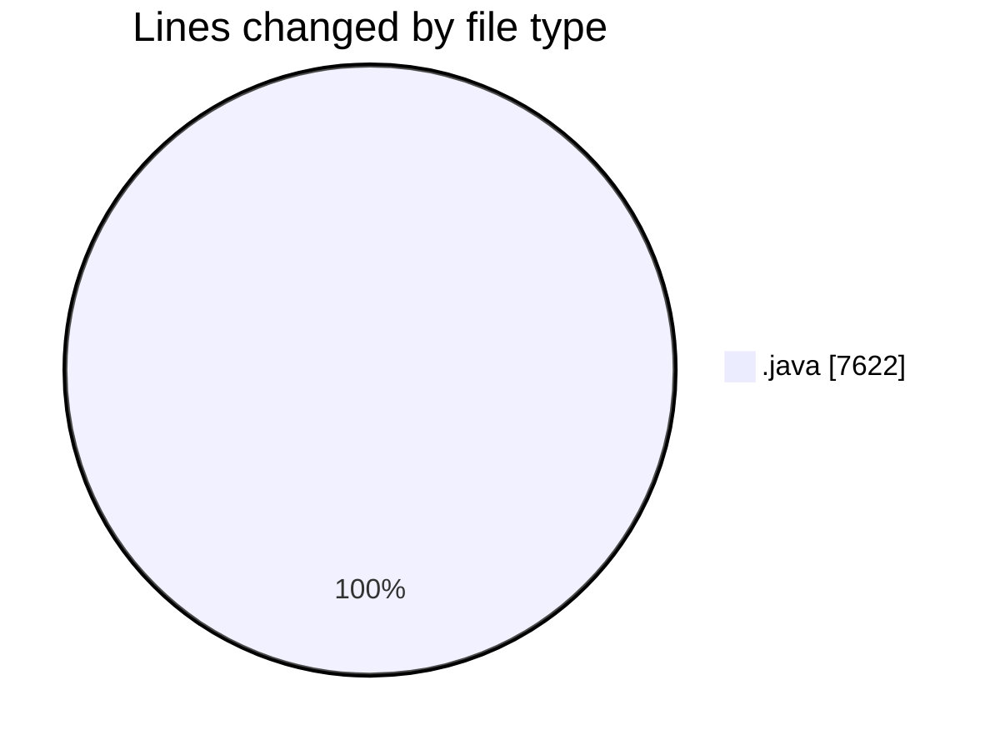
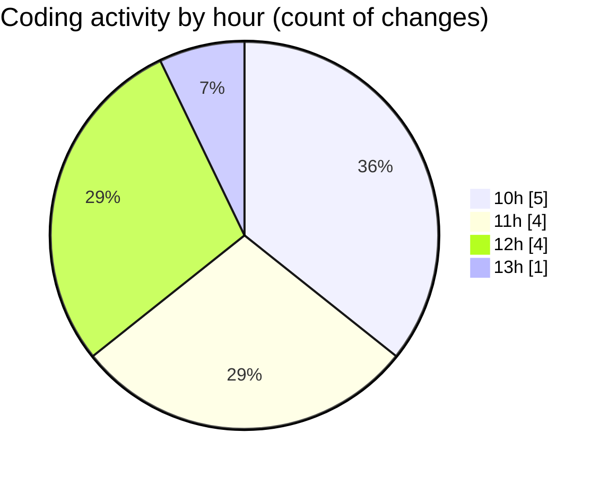

# CILApp - Activity Summary 

## Overall Statistics

| Stat                   | Value                                                             |
| ---------------------- | ----------------------------------------------------------------- |
| **Lines Added** (➕)   | 7616                                          |
| **Lines Removed** (➖) | 6                                        |
| **Net Change** (↕)    | 7610                |
| **Active Time** (⌚)   | 14 minutes |

## Modified Files
- **PresentacionMonitorios.java** (+3617, -5)
- **MascSmsService.java** (+950, -1)
- **AsignacionPartidosJudiciales.java** (+186, -0)
- **insertaAsesoria.java** (+2158, -0)
- **ProcMonitorioToMASC.java** (+705, -0)

## Visualizations

### By File Type (Lines Changed)

### By Hour (Estimated Activity Count)

> **Last Updated:** 3/27/2026, 1:05:38 PM