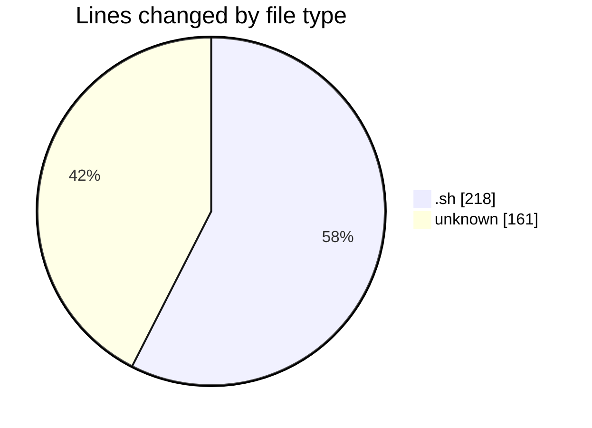
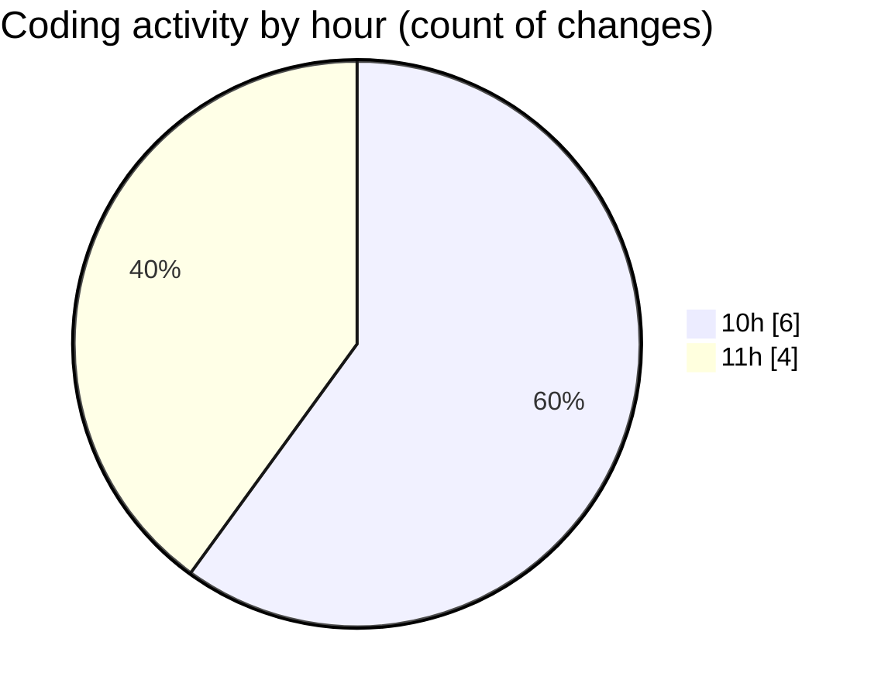

# Scripts - Activity Summary 

## Overall Statistics

| Stat                   | Value                                                             |
| ---------------------- | ----------------------------------------------------------------- |
| **Lines Added** (➕)   | 341                                          |
| **Lines Removed** (➖) | 38                                        |
| **Net Change** (↕)    | 303                |
| **Active Time** (⌚)   | 8 minutes |

## Modified Files
- **act_archivo_documental.sh** (+7, -0)
- **FTP_ESENDEX_ASE copy.sh** (+100, -0)
- **FTP_ESENDEX_ASE copy 2.sh** (+111, -0)
- **FTP_CP_ESMAD_TO_AIX_sh** (+123, -38)

## Visualizations

### By File Type (Lines Changed)

### By Hour (Estimated Activity Count)

> **Last Updated:** 3/30/2026, 11:29:26 AM