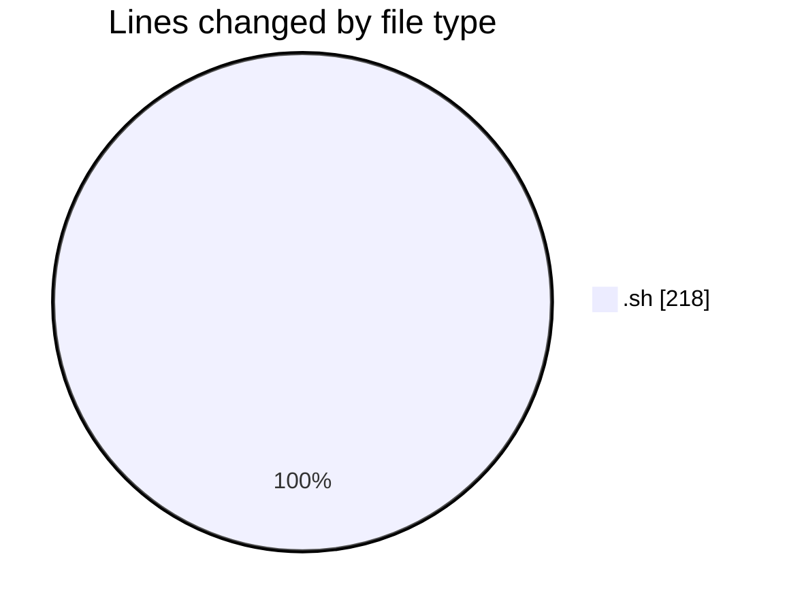
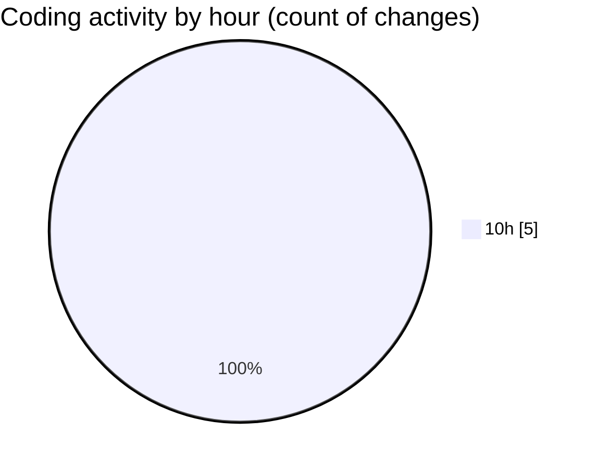

# Scripts - Activity Summary 

## Overall Statistics

| Stat                   | Value                                                             |
| ---------------------- | ----------------------------------------------------------------- |
| **Lines Added** (➕)   | 218                                          |
| **Lines Removed** (➖) | 0                                        |
| **Net Change** (↕)    | 218                |
| **Active Time** (⌚)   | 2 minutes |

## Modified Files
- **act_archivo_documental.sh** (+7, -0)
- **FTP_ESENDEX_ASE copy.sh** (+100, -0)
- **FTP_ESENDEX_ASE copy 2.sh** (+111, -0)

## Visualizations

### By File Type (Lines Changed)

### By Hour (Estimated Activity Count)

> **Last Updated:** 3/30/2026, 10:44:26 AM