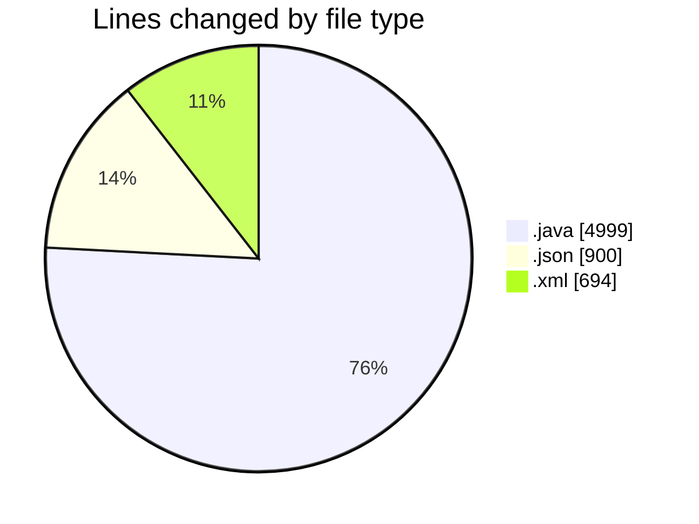
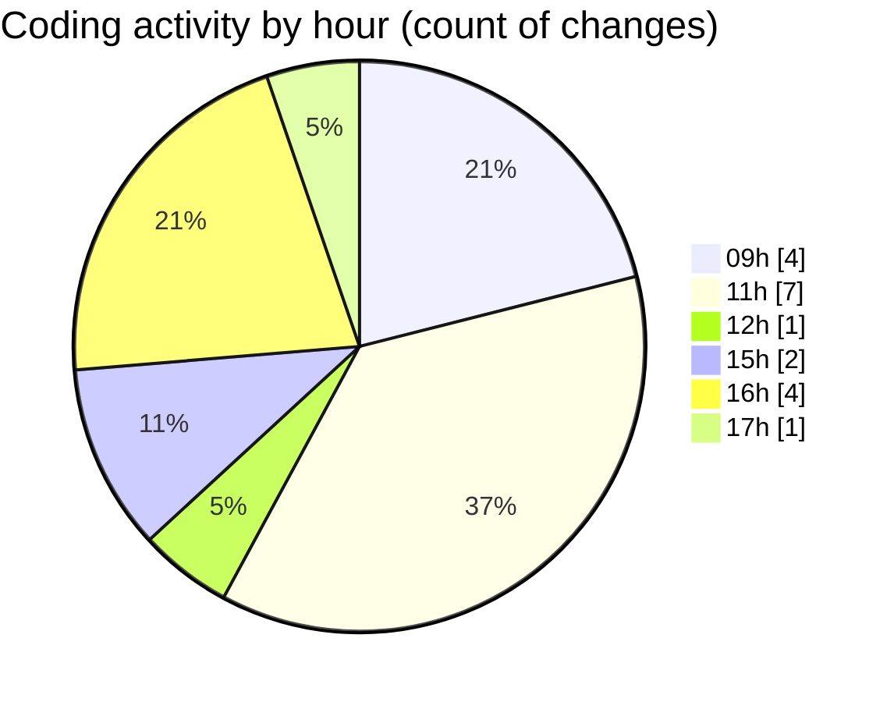

# CILApp - Activity Summary 

## Overall Statistics

| Stat                   | Value                                                             |
| ---------------------- | ----------------------------------------------------------------- |
| **Lines Added** (➕)   | 6445                                          |
| **Lines Removed** (➖) | 148                                        |
| **Net Change** (↕)    | 6297                |
| **Active Time** (⌚)   | 18 minutes |

## Modified Files
- **OfertasComerciales.java** (+2248, -148)
- **launch.json** (+900, -0)
- **pom.xml** (+694, -0)
- **PanelMonitoriosPtesImpresion.java** (+259, -0)
- **insertaAsesoria.java** (+2158, -0)
- **AsignacionPartidosJudiciales.java** (+186, -0)

## Visualizations

### By File Type (Lines Changed)

### By Hour (Estimated Activity Count)

> **Last Updated:** 3/31/2026, 5:09:18 PM