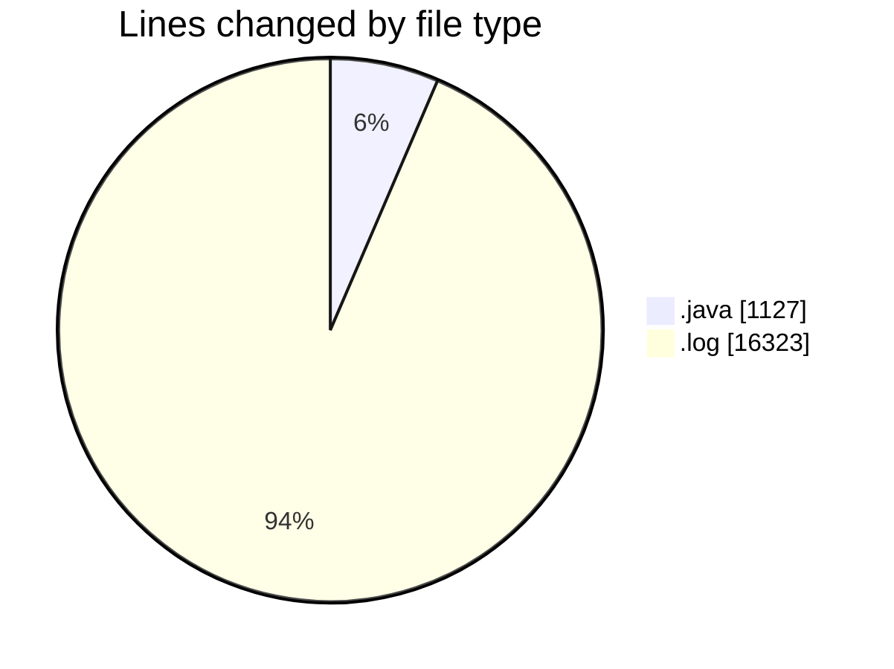
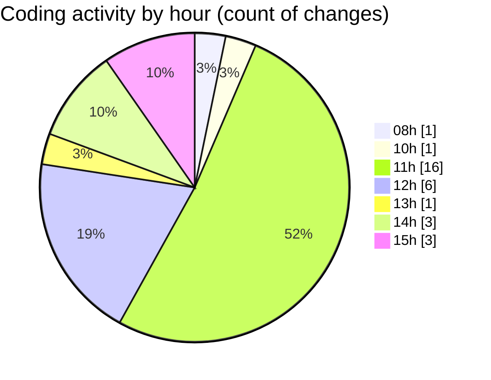

# CILApp - Activity Summary 

## Overall Statistics

| Stat                   | Value                                                             |
| ---------------------- | ----------------------------------------------------------------- |
| **Lines Added** (➕)   | 17399                                          |
| **Lines Removed** (➖) | 51                                        |
| **Net Change** (↕)    | 17348                |
| **Active Time** (⌚)   | 32 minutes |

## Modified Files
- **ProcMonitorioToMASC.java** (+110, -50)
- **AsignacionPartidosJudiciales.java** (+0, -1)
- **MascSmsService.java** (+949, -0)
- **cil-web-customer-com.log** (+16323, -0)
- **PresentacionMonitorios.java** (+17, -0)

## Visualizations

### By File Type (Lines Changed)

### By Hour (Estimated Activity Count)

> **Last Updated:** 4/7/2026, 3:05:26 PM