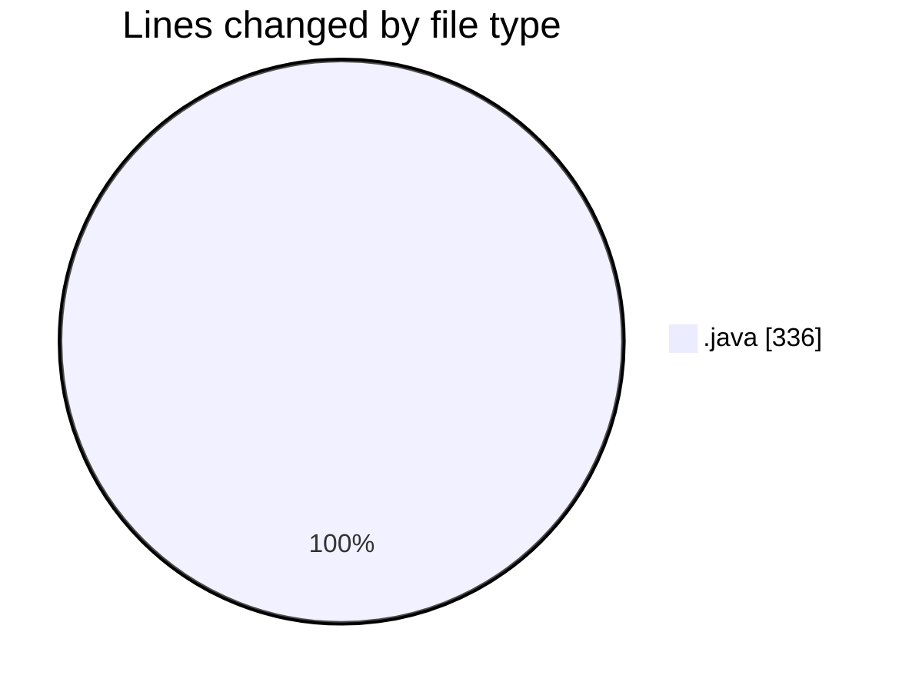
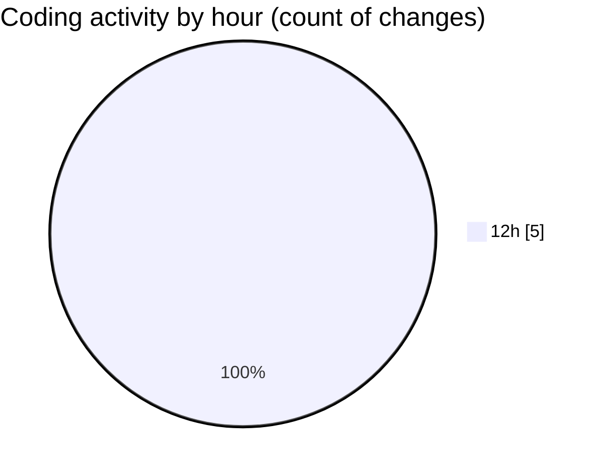

# CILApp - Activity Summary 

## Overall Statistics

| Stat                   | Value                                                             |
| ---------------------- | ----------------------------------------------------------------- |
| **Lines Added** (➕)   | 166                                          |
| **Lines Removed** (➖) | 170                                        |
| **Net Change** (↕)    | -4                |
| **Active Time** (⌚)   | 0 minute |

## Modified Files
- **ProcMonitorioToMASC.java** (+0, -55)
- **insertaAsesoria.java** (+0, -15)
- **AsignacionPartidosJudiciales.java** (+0, -1)
- **OfertasComerciales.java** (+0, -99)
- **PresentacionMonitorios.java** (+166, -0)

## Visualizations

### By File Type (Lines Changed)

### By Hour (Estimated Activity Count)

> **Last Updated:** 4/8/2026, 12:38:48 PM