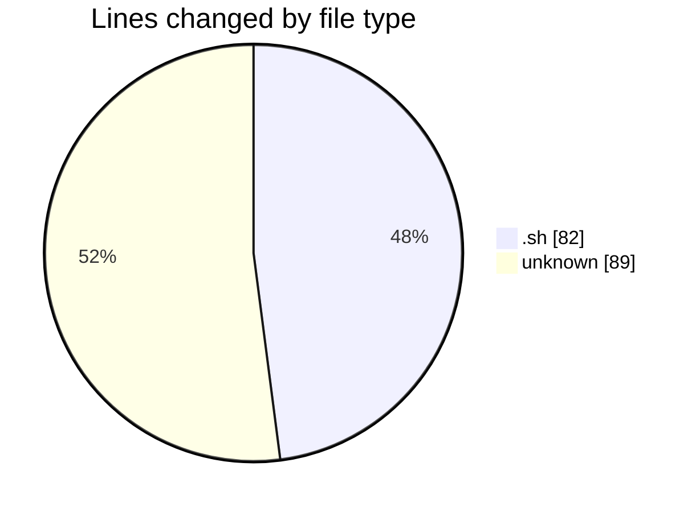
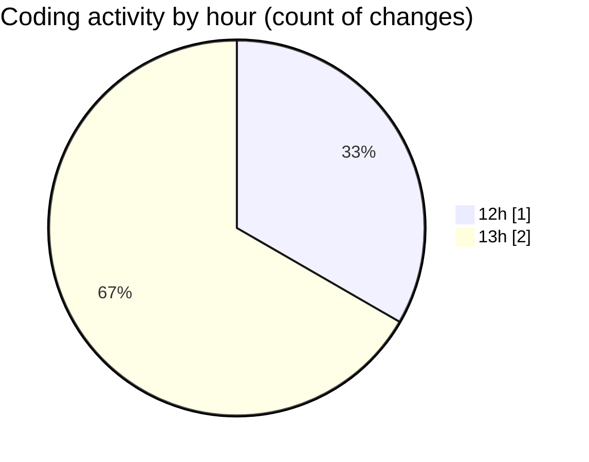

# Scripts - Activity Summary 

## Overall Statistics

| Stat                   | Value                                                             |
| ---------------------- | ----------------------------------------------------------------- |
| **Lines Added** (➕)   | 170                                          |
| **Lines Removed** (➖) | 1                                        |
| **Net Change** (↕)    | 169                |
| **Active Time** (⌚)   | 1 minute |

## Modified Files
- **FTP_ESENDEX_ASE.sh** (+82, -0)
- **FTP_CP_ESMAD_TO_AIX_sh** (+88, -1)

## Visualizations

### By File Type (Lines Changed)

### By Hour (Estimated Activity Count)

> **Last Updated:** 4/8/2026, 1:21:00 PM