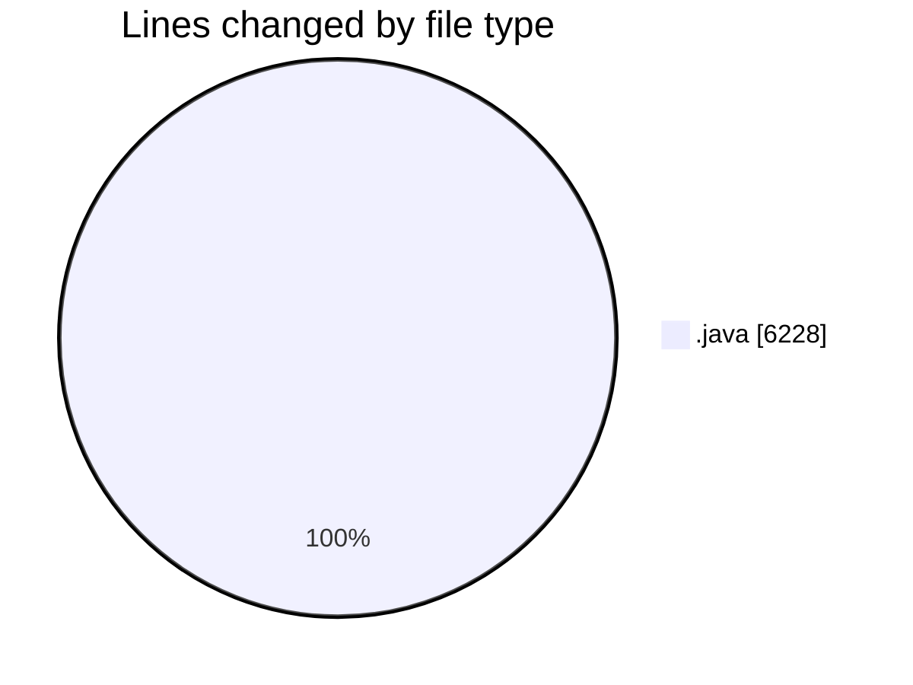
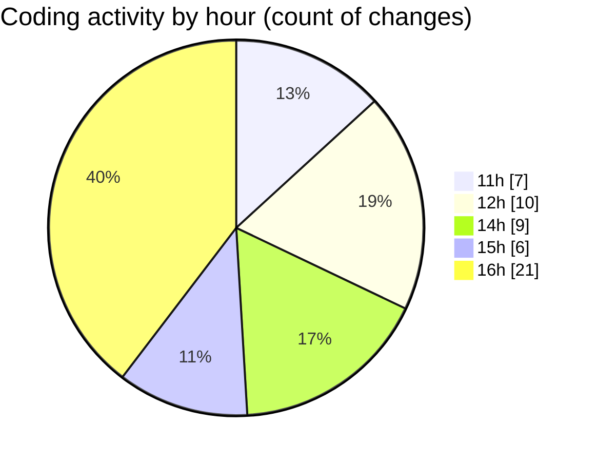

# CILApp - Activity Summary 

## Overall Statistics

| Stat                   | Value                                                             |
| ---------------------- | ----------------------------------------------------------------- |
| **Lines Added** (➕)   | 5378                                          |
| **Lines Removed** (➖) | 850                                        |
| **Net Change** (↕)    | 4528                |
| **Active Time** (⌚)   | 37 minutes |

## Modified Files
- **PresentacionMonitorios.java** (+255, -421)
- **ProcMonitorioToMASC.java** (+167, -155)
- **OfertasComerciales.java** (+198, -198)
- **ExtractorRutasMASC.java** (+1, -1)
- **insertaAsesoria.java** (+30, -15)
- **AsignacionPartidosJudiciales.java** (+2, -1)
- **PanelMantExpedientes.java** (+3942, -21)
- **ConsExpedientesAltas.java** (+783, -38)

## Visualizations

### By File Type (Lines Changed)

### By Hour (Estimated Activity Count)

> **Last Updated:** 4/9/2026, 7:35:22 PM