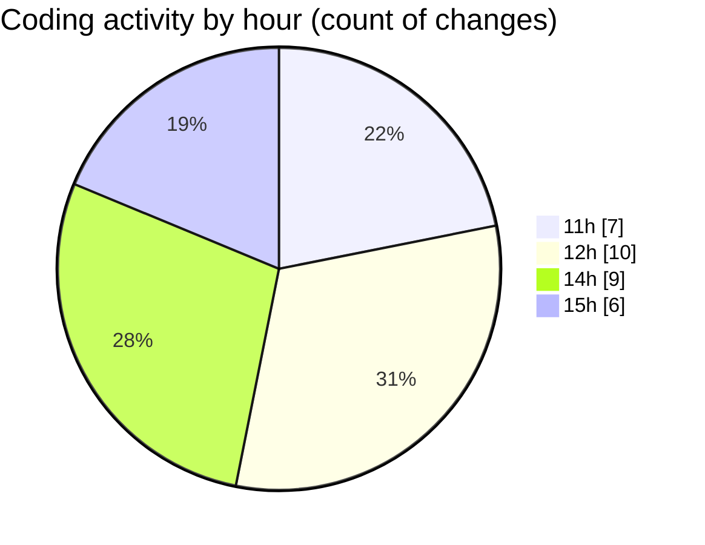

# CILApp - Activity Summary 

## Overall Statistics

| Stat                   | Value                                                             |
| ---------------------- | ----------------------------------------------------------------- |
| **Lines Added** (➕)   | 4970                                          |
| **Lines Removed** (➖) | 505                                        |
| **Net Change** (↕)    | 4465                |
| **Active Time** (⌚)   | 20 minutes |

## Modified Files
- **PresentacionMonitorios.java** (+158, -324)
- **ProcMonitorioToMASC.java** (+0, -80)
- **OfertasComerciales.java** (+99, -99)
- **ExtractorRutasMASC.java** (+1, -1)
- **insertaAsesoria.java** (+15, -0)
- **AsignacionPartidosJudiciales.java** (+1, -0)
- **PanelMantExpedientes.java** (+3932, -1)
- **ConsExpedientesAltas.java** (+764, -0)

## Visualizations

### By File Type (Lines Changed)

### By Hour (Estimated Activity Count)

> **Last Updated:** 4/9/2026, 3:41:30 PM