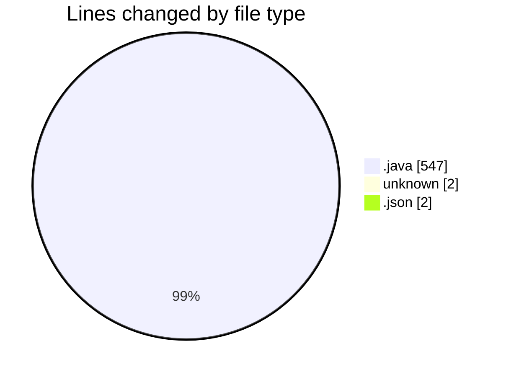
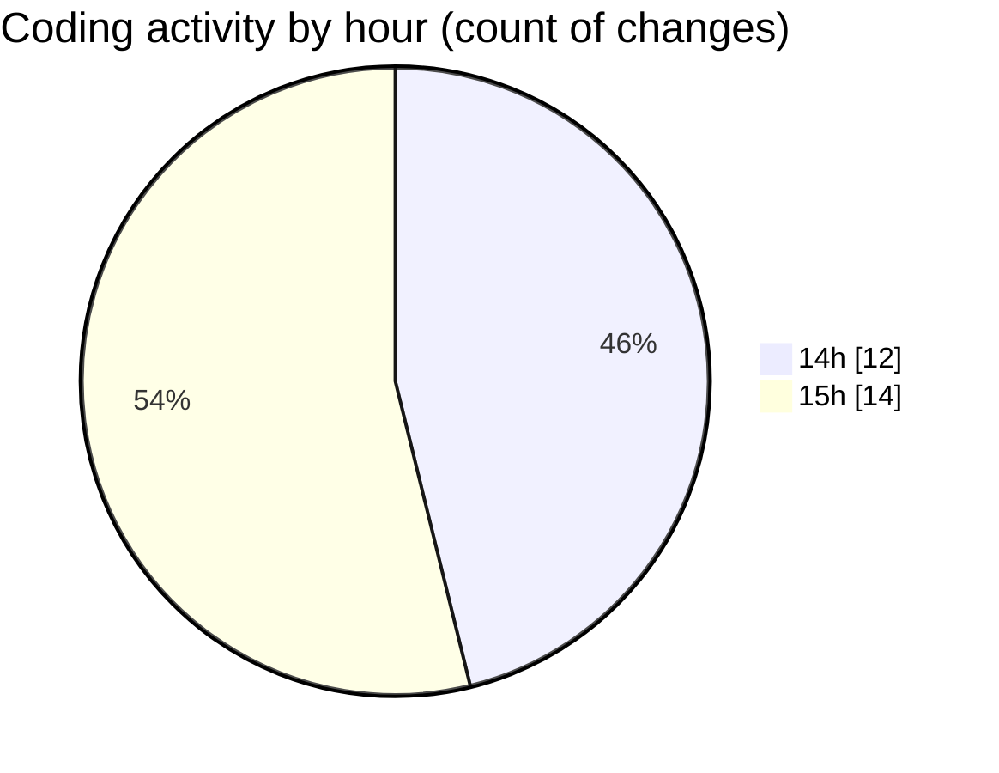

# CILApp - Activity Summary 

## Overall Statistics

| Stat                   | Value                                                             |
| ---------------------- | ----------------------------------------------------------------- |
| **Lines Added** (➕)   | 232                                          |
| **Lines Removed** (➖) | 319                                        |
| **Net Change** (↕)    | -87                |
| **Active Time** (⌚)   | 28 minutes |

## Modified Files
- **ProcMonitorioToMASC.java** (+89, -161)
- **insertaAsesoria.java** (+0, -15)
- **AsignacionPartidosJudiciales.java** (+15, -13)
- **PresentacionMonitorios.java** (+97, -0)
- **COMMIT_EDITMSG** (+2, -0)
- **PanelMantExpedientes.java** (+10, -10)
- **ConsExpedientesAltas.java** (+19, -19)
- **launch.json** (+0, -2)
- **OfertasComerciales.java** (+0, -99)

## Visualizations

### By File Type (Lines Changed)

### By Hour (Estimated Activity Count)

> **Last Updated:** 4/10/2026, 3:49:38 PM