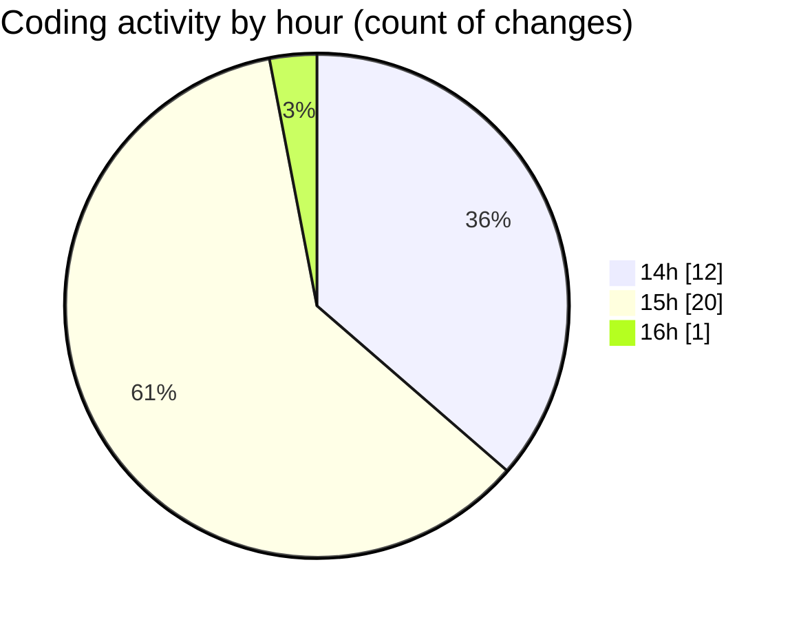

# CILApp - Activity Summary 

## Overall Statistics

| Stat                   | Value                                                             |
| ---------------------- | ----------------------------------------------------------------- |
| **Lines Added** (➕)   | 440                                          |
| **Lines Removed** (➖) | 322                                        |
| **Net Change** (↕)    | 118                |
| **Active Time** (⌚)   | 54 minutes |

## Modified Files
- **ProcMonitorioToMASC.java** (+169, -161)
- **insertaAsesoria.java** (+0, -15)
- **AsignacionPartidosJudiciales.java** (+15, -16)
- **PresentacionMonitorios.java** (+97, -0)
- **COMMIT_EDITMSG** (+2, -0)
- **PanelMantExpedientes.java** (+20, -10)
- **ConsExpedientesAltas.java** (+38, -19)
- **launch.json** (+0, -2)
- **OfertasComerciales.java** (+99, -99)

## Visualizations

### By File Type (Lines Changed)

### By Hour (Estimated Activity Count)

> **Last Updated:** 4/10/2026, 4:09:38 PM