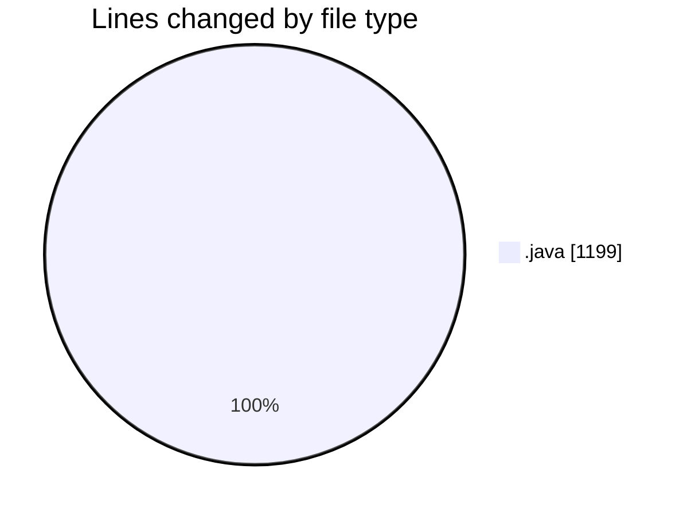
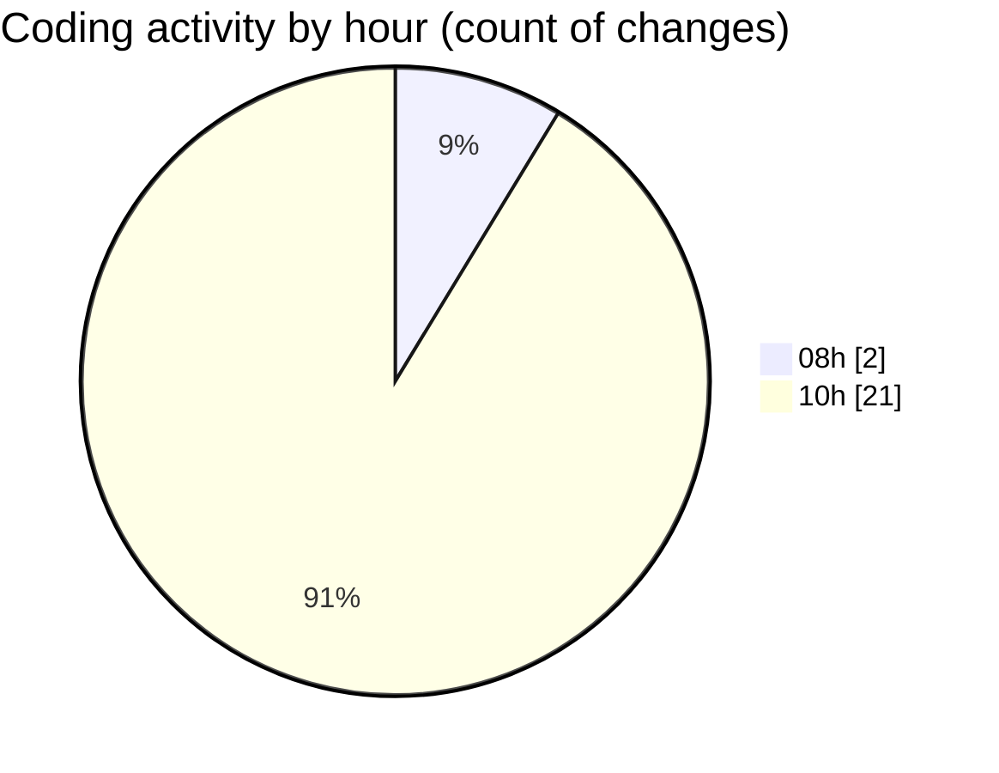

# CILApp - Activity Summary 

## Overall Statistics

| Stat                   | Value                                                             |
| ---------------------- | ----------------------------------------------------------------- |
| **Lines Added** (➕)   | 746                                          |
| **Lines Removed** (➖) | 453                                        |
| **Net Change** (↕)    | 293                |
| **Active Time** (⌚)   | 26 minutes |

## Modified Files
- **ExportacionMonitoringPedidos.java** (+314, -1)
- **insertaAsesoria.java** (+15, -15)
- **ProcMonitorioToMASC.java** (+163, -183)
- **PresentacionMonitorios.java** (+97, -97)
- **PanelMantExpedientes.java** (+20, -20)
- **ConsExpedientesAltas.java** (+38, -38)
- **OfertasComerciales.java** (+99, -99)

## Visualizations

### By File Type (Lines Changed)

### By Hour (Estimated Activity Count)

> **Last Updated:** 4/13/2026, 10:59:36 AM