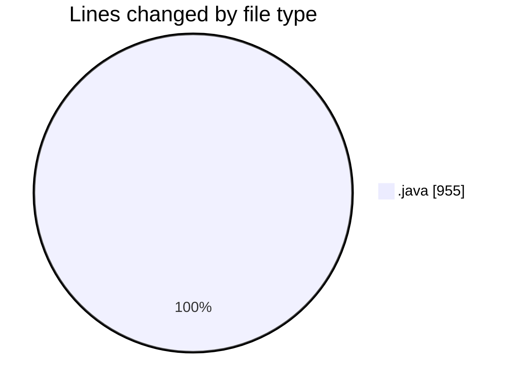
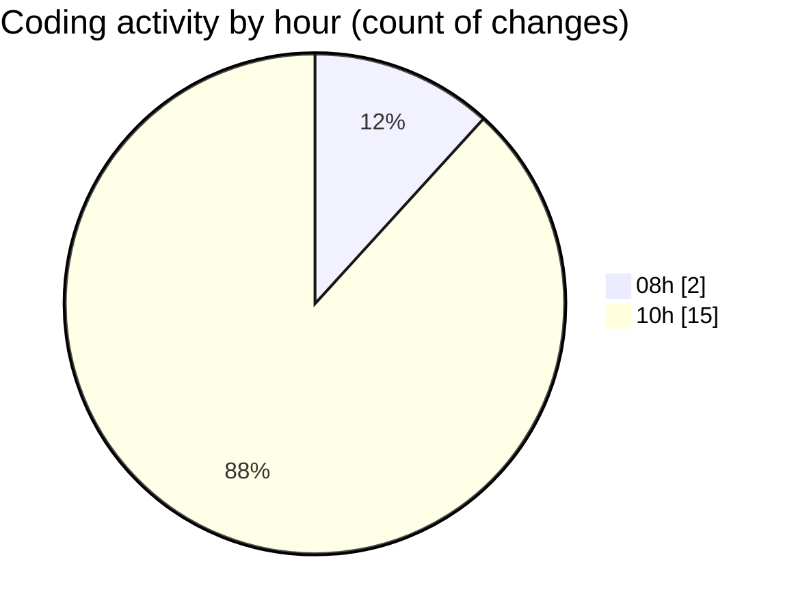

# CILApp - Activity Summary 

## Overall Statistics

| Stat                   | Value                                                             |
| ---------------------- | ----------------------------------------------------------------- |
| **Lines Added** (➕)   | 530                                          |
| **Lines Removed** (➖) | 425                                        |
| **Net Change** (↕)    | 105                |
| **Active Time** (⌚)   | 18 minutes |

## Modified Files
- **ExportacionMonitoringPedidos.java** (+314, -1)
- **insertaAsesoria.java** (+15, -15)
- **ProcMonitorioToMASC.java** (+75, -155)
- **PresentacionMonitorios.java** (+97, -97)
- **PanelMantExpedientes.java** (+10, -20)
- **ConsExpedientesAltas.java** (+19, -38)
- **OfertasComerciales.java** (+0, -99)

## Visualizations

### By File Type (Lines Changed)

### By Hour (Estimated Activity Count)

> **Last Updated:** 4/13/2026, 10:54:36 AM