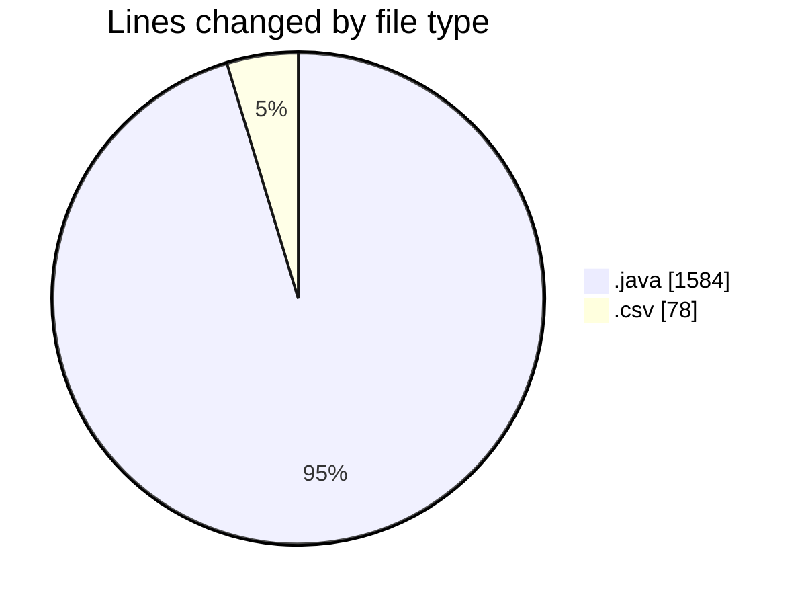
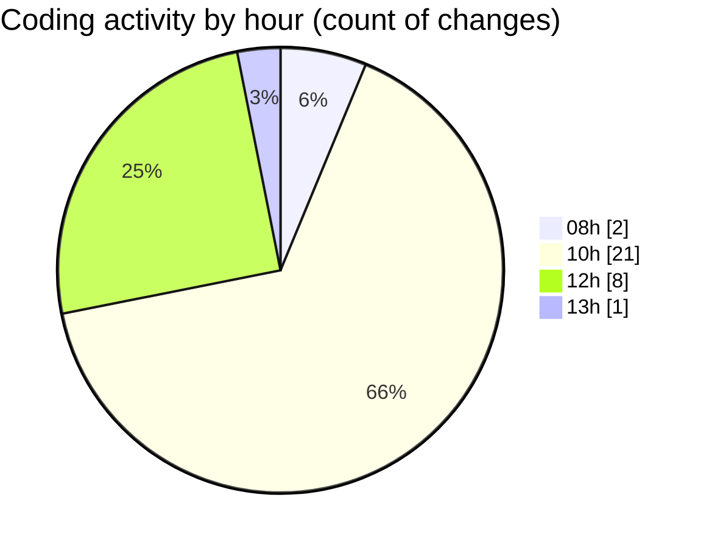

# CILApp - Activity Summary 

## Overall Statistics

| Stat                   | Value                                                             |
| ---------------------- | ----------------------------------------------------------------- |
| **Lines Added** (➕)   | 1017                                          |
| **Lines Removed** (➖) | 645                                        |
| **Net Change** (↕)    | 372                |
| **Active Time** (⌚)   | 30 minutes |

## Modified Files
- **ExportacionMonitoringPedidos.java** (+315, -1)
- **insertaAsesoria.java** (+30, -30)
- **ProcMonitorioToMASC.java** (+243, -263)
- **PresentacionMonitorios.java** (+194, -194)
- **PanelMantExpedientes.java** (+20, -20)
- **ConsExpedientesAltas.java** (+38, -38)
- **OfertasComerciales.java** (+99, -99)
- **csv alt_movalm.csv** (+78, -0)

## Visualizations

### By File Type (Lines Changed)

### By Hour (Estimated Activity Count)

> **Last Updated:** 4/13/2026, 1:14:36 PM