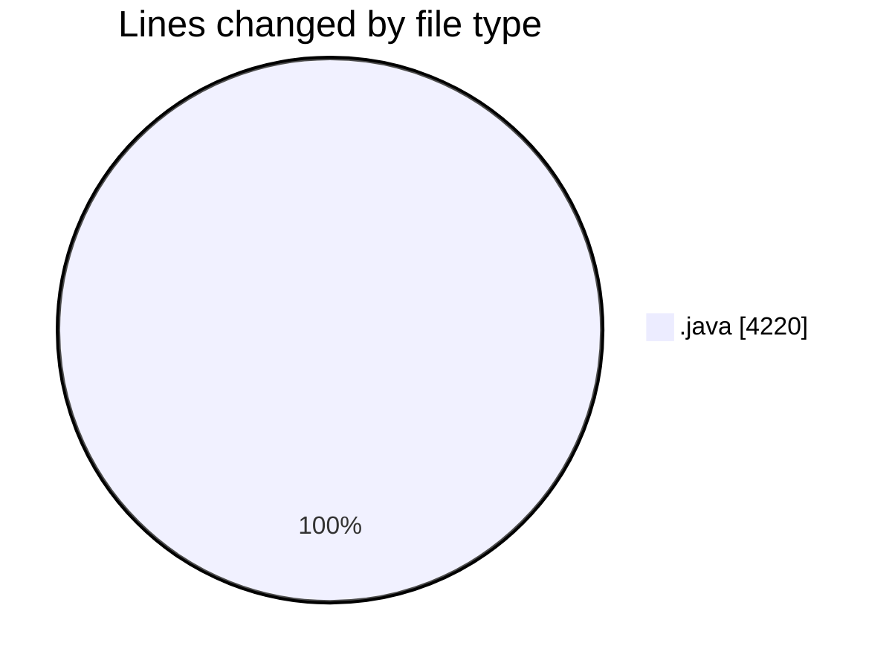
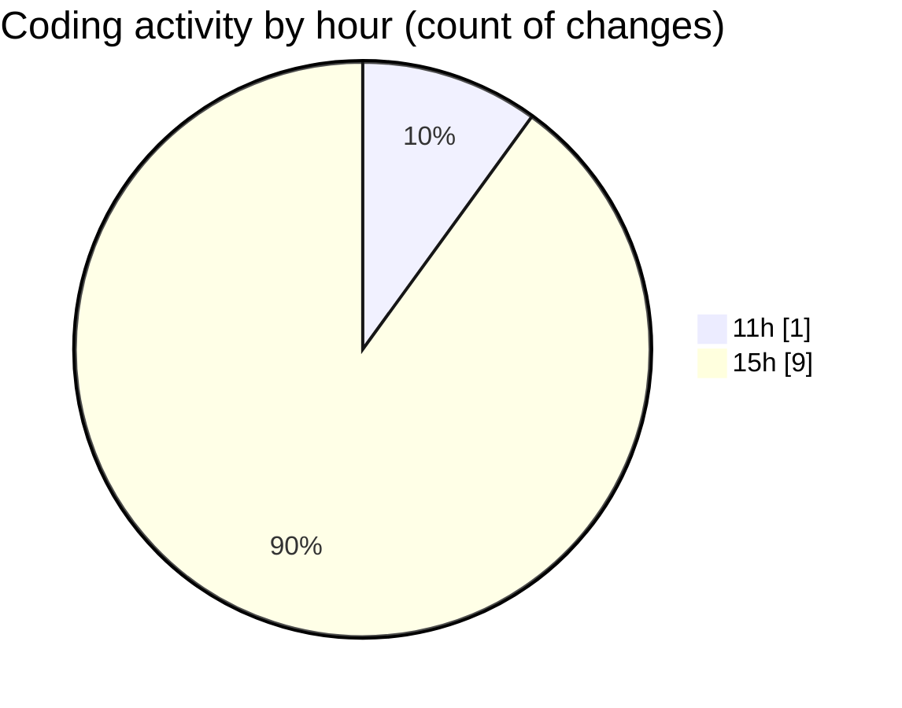

# CILApp - Activity Summary 

## Overall Statistics

| Stat                   | Value                                                             |
| ---------------------- | ----------------------------------------------------------------- |
| **Lines Added** (➕)   | 2470                                          |
| **Lines Removed** (➖) | 1750                                        |
| **Net Change** (↕)    | 720                |
| **Active Time** (⌚)   | 0 minute |

## Modified Files
- **ExportacionMonitoringPedidos.java** (+0, -6)
- **MascSmsService.java** (+0, -573)
- **OfertasComerciales.java** (+0, -122)
- **ProcMonitorioToMASC.java** (+0, -377)
- **PresentacionMonitorios.java** (+0, -643)
- **insertaAsesoria.java** (+15, -0)
- **AsignacionProcurador.java** (+402, -0)
- **FicherosAgenciasRecobro.java** (+2053, -0)
- **ConsExpedientesAltas.java** (+0, -19)
- **PanelMantExpedientes.java** (+0, -10)

## Visualizations

### By File Type (Lines Changed)

### By Hour (Estimated Activity Count)

> **Last Updated:** 4/14/2026, 3:32:48 PM