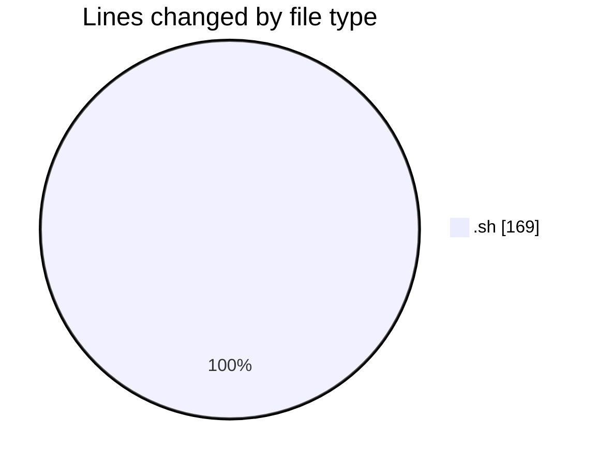
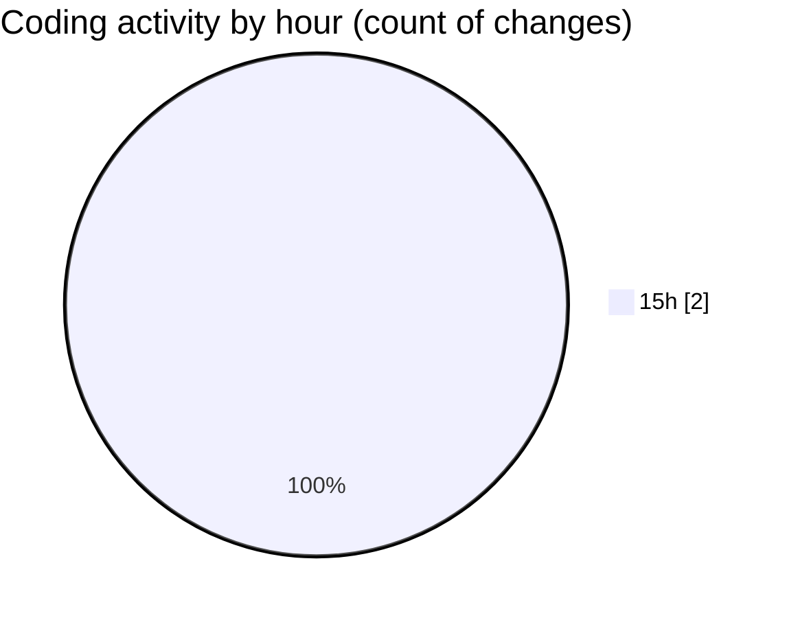

# Scripts - Activity Summary 

## Overall Statistics

| Stat                   | Value                                                             |
| ---------------------- | ----------------------------------------------------------------- |
| **Lines Added** (➕)   | 169                                          |
| **Lines Removed** (➖) | 0                                        |
| **Net Change** (↕)    | 169                |
| **Active Time** (⌚)   | 1 minute |

## Modified Files
- **FTP_ESENDEX_ASE.sh** (+82, -0)
- **FTP_ESMAD_TO_AIX_ASE.sh** (+87, -0)

## Visualizations

### By File Type (Lines Changed)

### By Hour (Estimated Activity Count)

> **Last Updated:** 4/14/2026, 3:03:03 PM