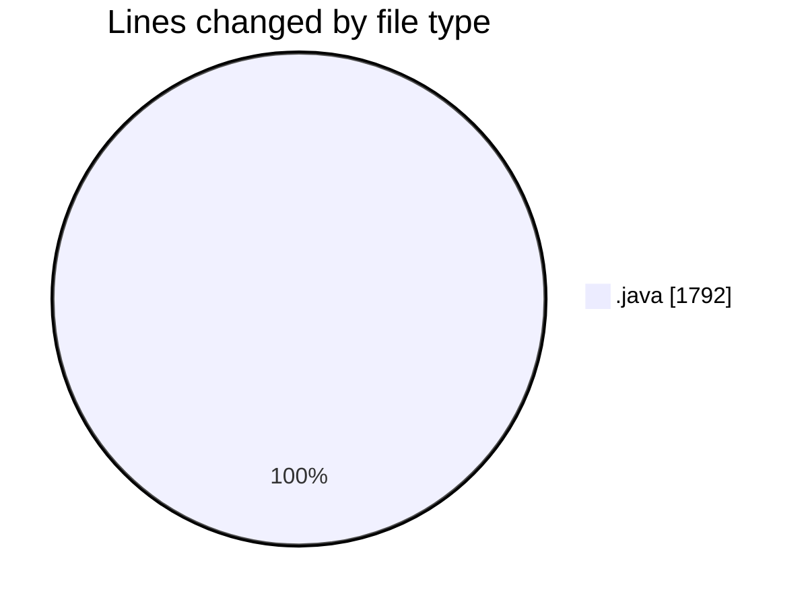
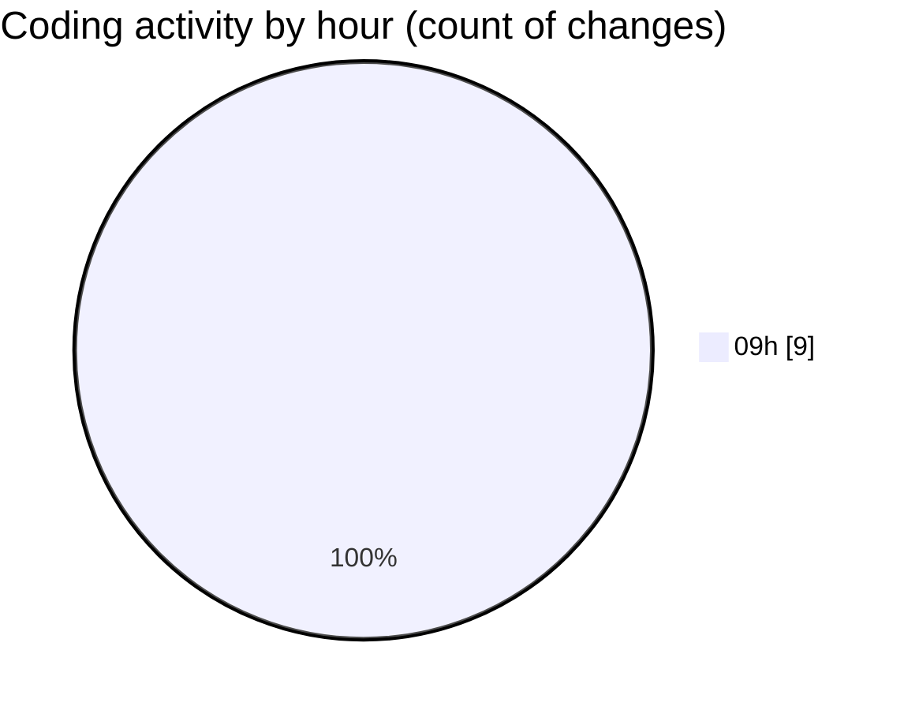

# CILApp - Activity Summary 

## Overall Statistics

| Stat                   | Value                                                             |
| ---------------------- | ----------------------------------------------------------------- |
| **Lines Added** (➕)   | 1777                                          |
| **Lines Removed** (➖) | 15                                        |
| **Net Change** (↕)    | 1762                |
| **Active Time** (⌚)   | 0 minute |

## Modified Files
- **OfertasComerciales.java** (+122, -0)
- **insertaAsesoria.java** (+0, -15)
- **PresentacionMonitorios.java** (+643, -0)
- **ProcMonitorioToMASC.java** (+377, -0)
- **MascSmsService.java** (+573, -0)
- **FicherosAgenciasRecobro.java** (+15, -0)
- **AsignacionProcurador.java** (+18, -0)
- **ConsExpedientesAltas.java** (+19, -0)
- **PanelMantExpedientes.java** (+10, -0)

## Visualizations

### By File Type (Lines Changed)

### By Hour (Estimated Activity Count)

> **Last Updated:** 4/16/2026, 9:28:53 AM