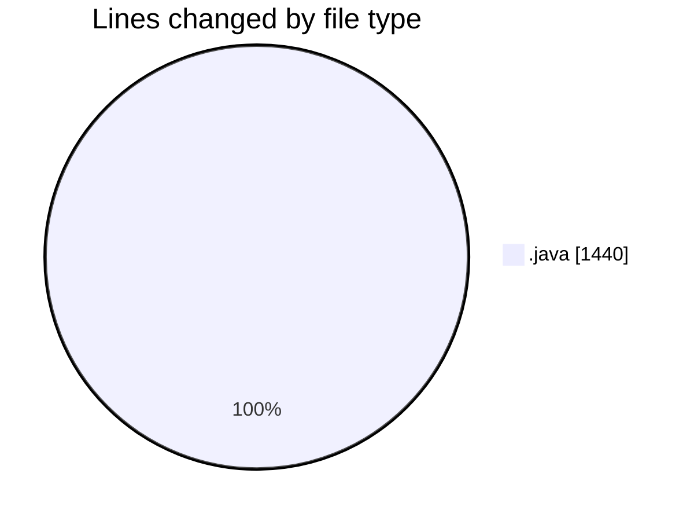
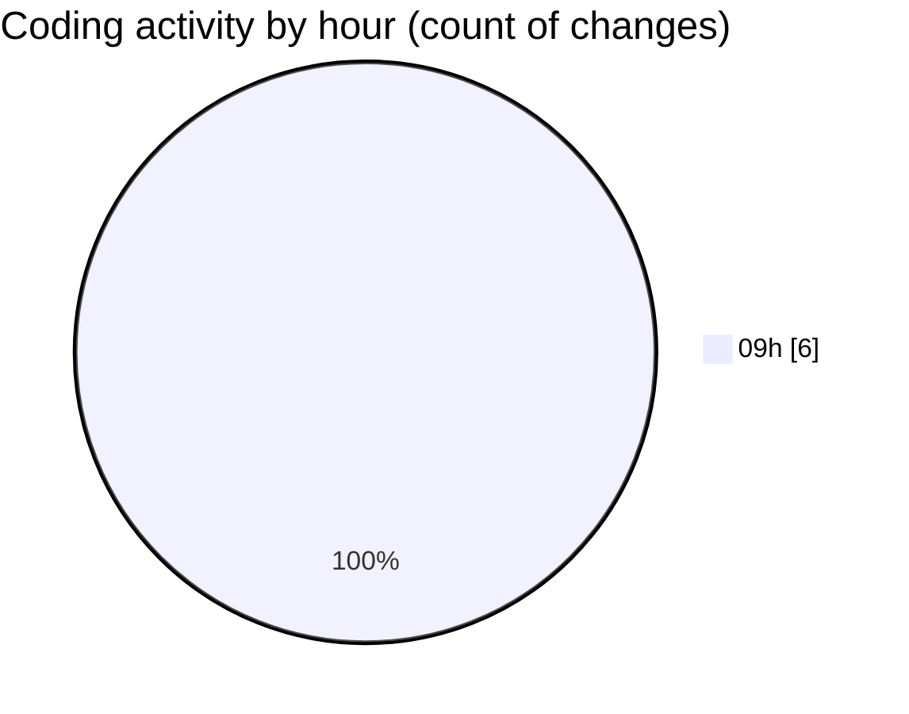

# CILApp - Activity Summary 

## Overall Statistics

| Stat                   | Value                                                             |
| ---------------------- | ----------------------------------------------------------------- |
| **Lines Added** (➕)   | 1270                                          |
| **Lines Removed** (➖) | 170                                        |
| **Net Change** (↕)    | 1100                |
| **Active Time** (⌚)   | 1 minute |

## Modified Files
- **PanelConsultaGeneralNew.java** (+0, -130)
- **ProcMonitorioToMASC.java** (+0, -40)
- **ExportacionMonitoringPedidos.java** (+319, -0)
- **MascSmsService.java** (+949, -0)
- **CustomerComBatchClient.java** (+1, -0)
- **CustomerComBatchClient.java** (+1, -0)

## Visualizations

### By File Type (Lines Changed)

### By Hour (Estimated Activity Count)

> **Last Updated:** 4/23/2026, 9:45:05 AM