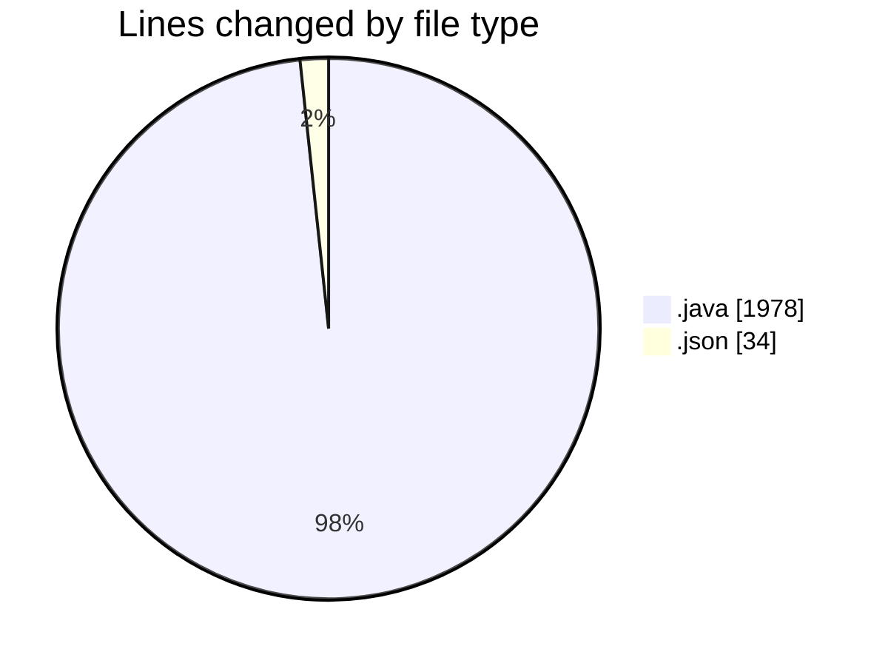
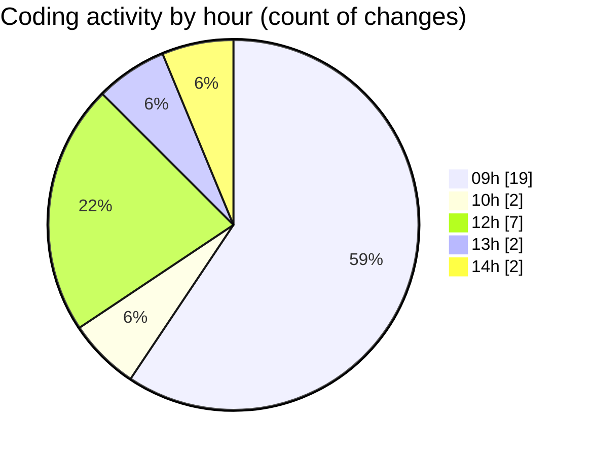

# CILApp - Activity Summary 

## Overall Statistics

| Stat                   | Value                                                             |
| ---------------------- | ----------------------------------------------------------------- |
| **Lines Added** (➕)   | 1828                                          |
| **Lines Removed** (➖) | 184                                        |
| **Net Change** (↕)    | 1644                |
| **Active Time** (⌚)   | 37 minutes |

## Modified Files
- **PanelConsultaGeneralNew.java** (+130, -131)
- **ProcMonitorioToMASC.java** (+40, -40)
- **ExportacionMonitoringPedidos.java** (+319, -6)
- **MascSmsService.java** (+949, -0)
- **CustomerComBatchClient.java** (+1, -0)
- **CustomerComBatchClient.java** (+79, -0)
- **MetadataBuilder.java** (+1, -0)
- **MetadataBuilder.java** (+20, -0)
- **MetadataBuilder.java** (+20, -0)
- **CustomerComBatchClient.java** (+79, -0)
- **SeleccionVendedoresDC.java** (+156, -7)
- **launch.json** (+34, -0)

## Visualizations

### By File Type (Lines Changed)

### By Hour (Estimated Activity Count)

> **Last Updated:** 4/23/2026, 2:20:06 PM