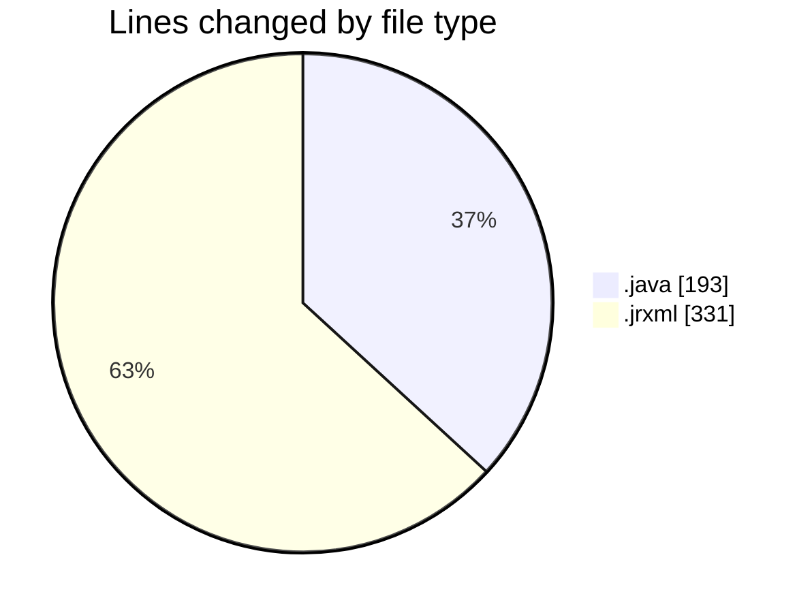
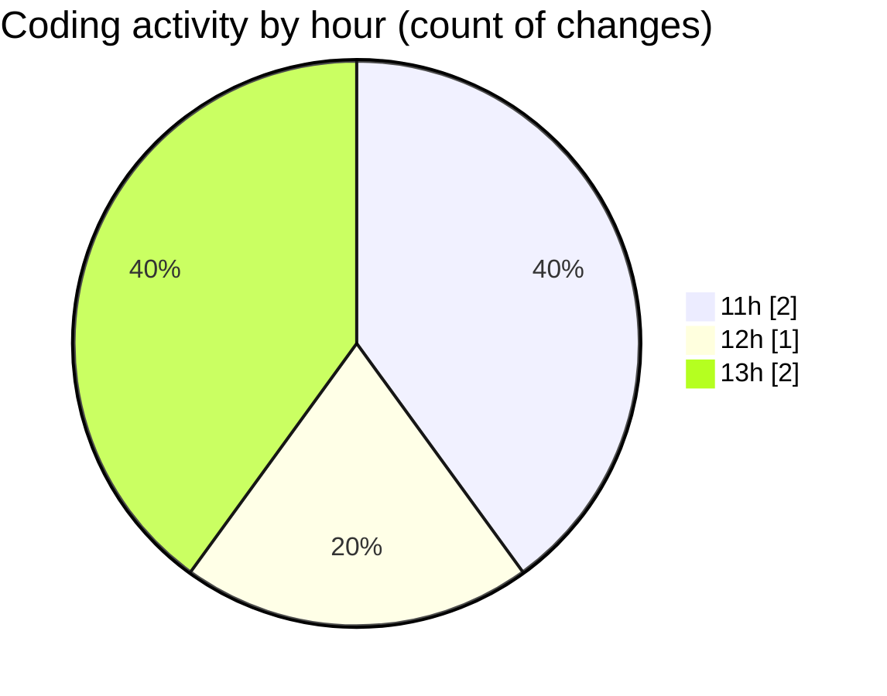

# CILReports (Workspace) - Activity Summary 

## Overall Statistics

| Stat                   | Value                                                             |
| ---------------------- | ----------------------------------------------------------------- |
| **Lines Added** (➕)   | 524                                          |
| **Lines Removed** (➖) | 0                                        |
| **Net Change** (↕)    | 524                |
| **Active Time** (⌚)   | 2 minutes |

## Modified Files
- **CilJasperReportApplication.java** (+54, -0)
- **JasperVendedoresService.java** (+96, -0)
- **JasperVendedoresRestController.java** (+43, -0)
- **ListaVendedores.jrxml** (+331, -0)

## Visualizations

### By File Type (Lines Changed)

### By Hour (Estimated Activity Count)

> **Last Updated:** 4/24/2026, 1:08:06 PM