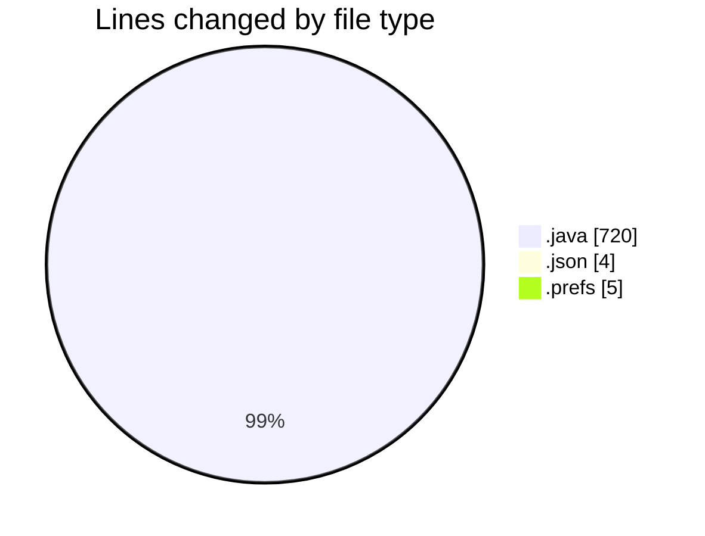
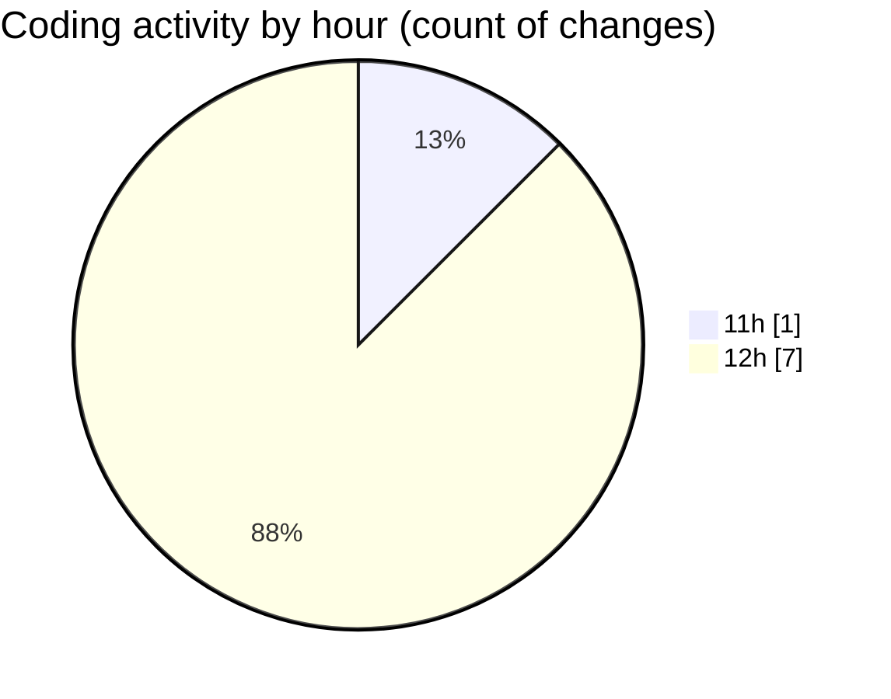

# CILWebCustomerComunication - Activity Summary 

## Overall Statistics

| Stat                   | Value                                                             |
| ---------------------- | ----------------------------------------------------------------- |
| **Lines Added** (➕)   | 728                                          |
| **Lines Removed** (➖) | 1                                        |
| **Net Change** (↕)    | 727                |
| **Active Time** (⌚)   | 10 minutes |

## Modified Files
- **CilCustomerComunication.java** (+52, -0)
- **settings.json** (+4, -0)
- **org.eclipse.m2e.core.prefs** (+5, -0)
- **GeneratePdfServiceAdapter.java** (+146, -1)
- **CilReportGenerateWebClient.java** (+140, -0)
- **SendServiceImpl.java** (+381, -0)

## Visualizations

### By File Type (Lines Changed)

### By Hour (Estimated Activity Count)

> **Last Updated:** 4/24/2026, 12:32:43 PM