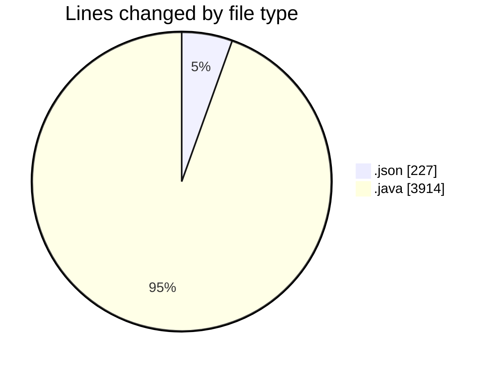
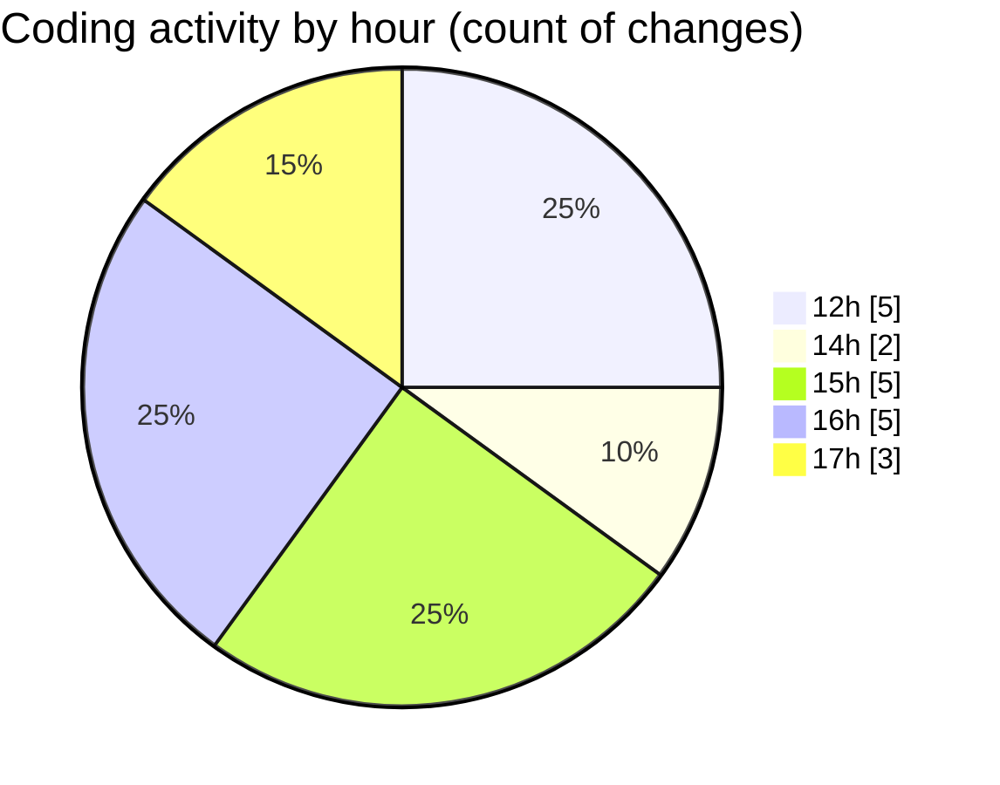

# CILApp - Activity Summary 

## Overall Statistics

| Stat                   | Value                                                             |
| ---------------------- | ----------------------------------------------------------------- |
| **Lines Added** (➕)   | 4105                                          |
| **Lines Removed** (➖) | 36                                        |
| **Net Change** (↕)    | 4069                |
| **Active Time** (⌚)   | 25 minutes |

## Modified Files
- **settings.json** (+227, -0)
- **MascSmsService.java** (+949, -0)
- **ProcMonitorioToMASC.java** (+417, -0)
- **insertaAsesoria.java** (+2143, -0)
- **SeleccionVendedoresDC.java** (+169, -26)
- **CustomerComBatchClient.java** (+87, -0)
- **CilReportClient.java** (+65, -10)
- **RequestPreviewDTO.java** (+6, -0)
- **Constantes.java** (+42, -0)

## Visualizations

### By File Type (Lines Changed)

### By Hour (Estimated Activity Count)

> **Last Updated:** 5/4/2026, 5:04:08 PM