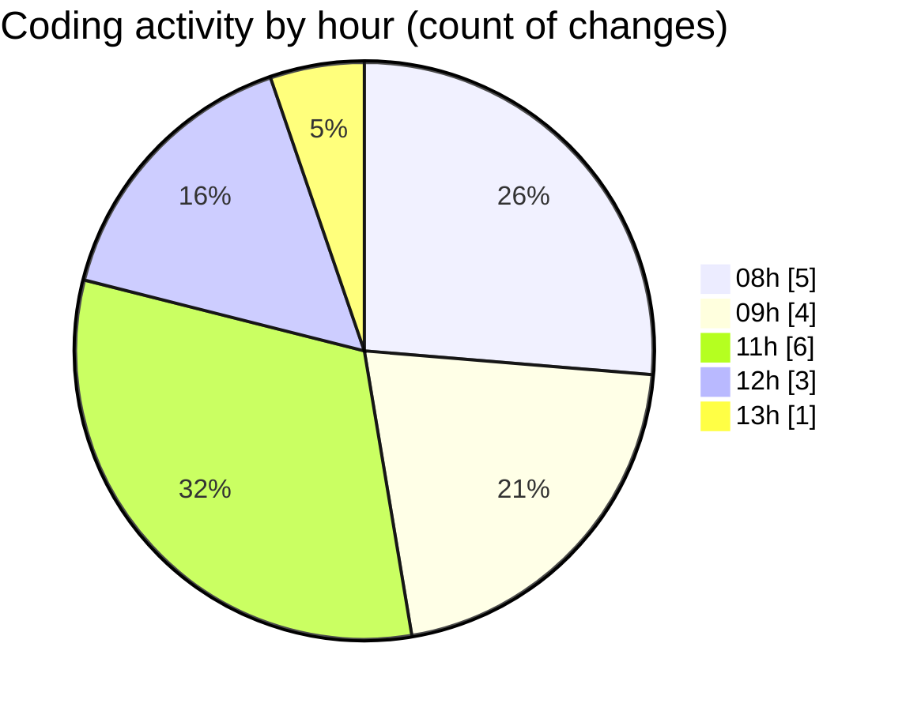

# CILApp - Activity Summary 

## Overall Statistics

| Stat                   | Value                                                             |
| ---------------------- | ----------------------------------------------------------------- |
| **Lines Added** (➕)   | 4522                                          |
| **Lines Removed** (➖) | 1471                                        |
| **Net Change** (↕)    | 3051                |
| **Active Time** (⌚)   | 16 minutes |

## Modified Files
- **Constantes.java** (+0, -3)
- **SeleccionVendedoresDC.java** (+138, -274)
- **MascSmsService.java** (+0, -573)
- **ProcMonitorioToMASC.java** (+0, -417)
- **insertaAsesoria.java** (+15, -0)
- **PanelMantExpedientes.java** (+4338, -204)
- **MigracionAccessToDb2.java** (+31, -0)

## Visualizations

### By File Type (Lines Changed)

### By Hour (Estimated Activity Count)

> **Last Updated:** 5/5/2026, 1:18:38 PM