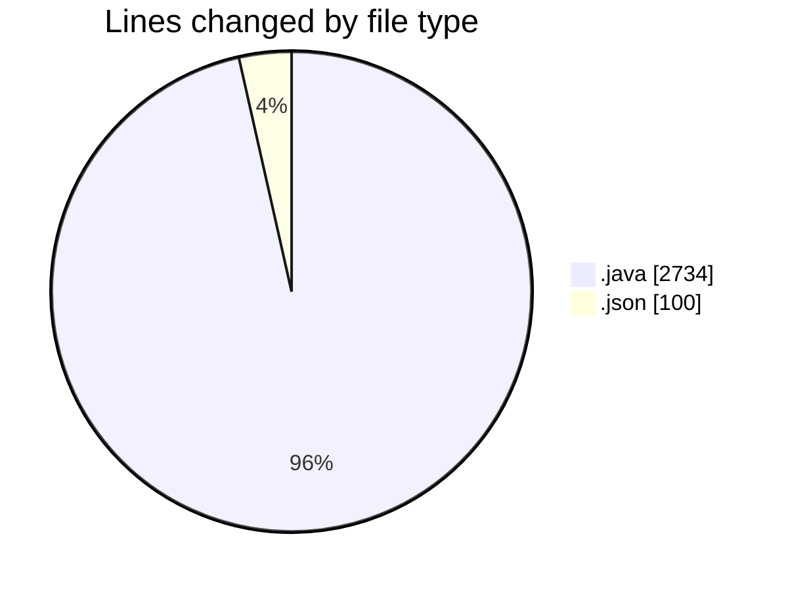
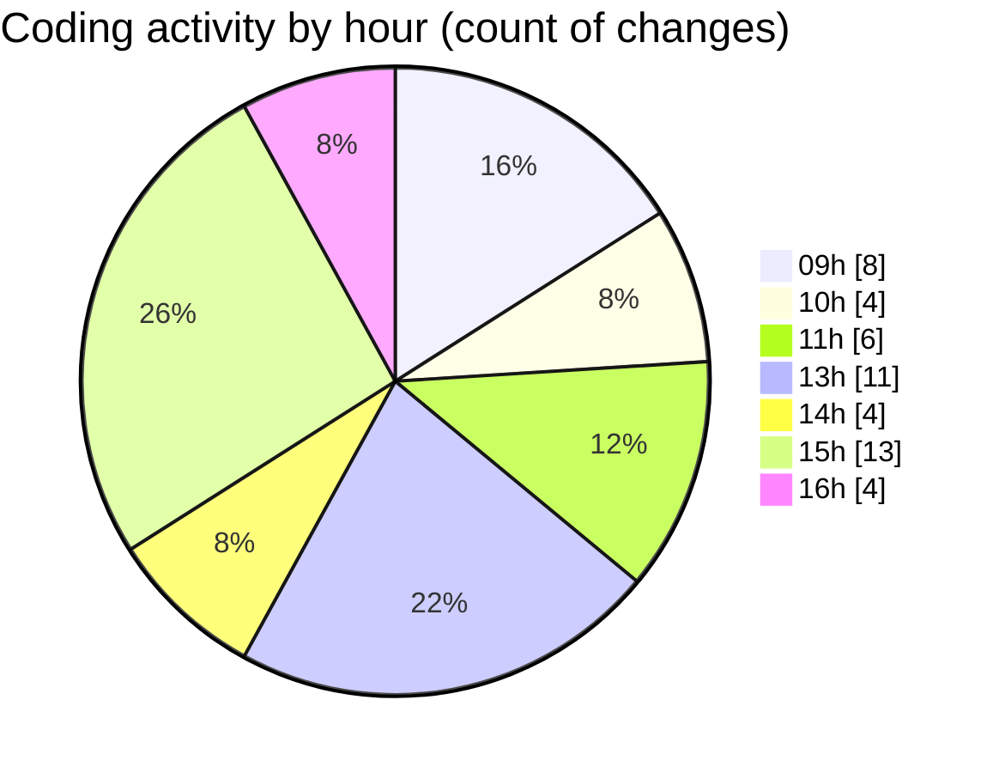

# CILApp - Activity Summary 

## Overall Statistics

| Stat                   | Value                                                             |
| ---------------------- | ----------------------------------------------------------------- |
| **Lines Added** (➕)   | 1217                                          |
| **Lines Removed** (➖) | 1617                                        |
| **Net Change** (↕)    | -400                |
| **Active Time** (⌚)   | 41 minutes |

## Modified Files
- **SeleccionVendedoresDC.java** (+266, -273)
- **ProcMonitorioToMASC.java** (+82, -487)
- **MascSmsService.java** (+2, -575)
- **PanelConsultaGeneralNew.java** (+144, -274)
- **ProcesoMarcajeCertificacion.java** (+294, -0)
- **keybindings.json** (+100, -0)
- **EstadoEssendexSMS.java** (+26, -0)
- **EstadisticasMASC.java** (+34, -7)
- **PanelMantExpedientes.java** (+269, -1)

## Visualizations

### By File Type (Lines Changed)

### By Hour (Estimated Activity Count)

> **Last Updated:** 5/12/2026, 4:33:21 PM