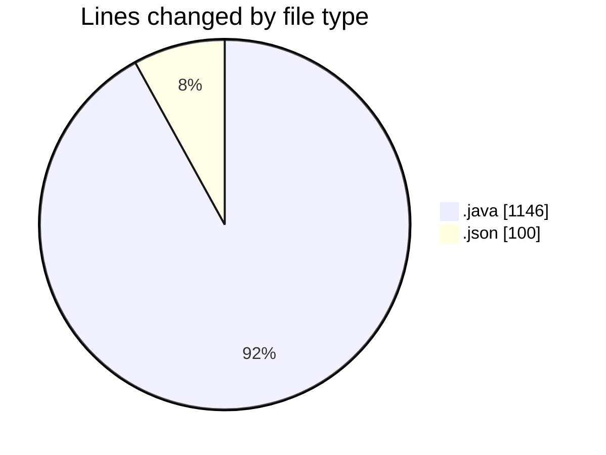
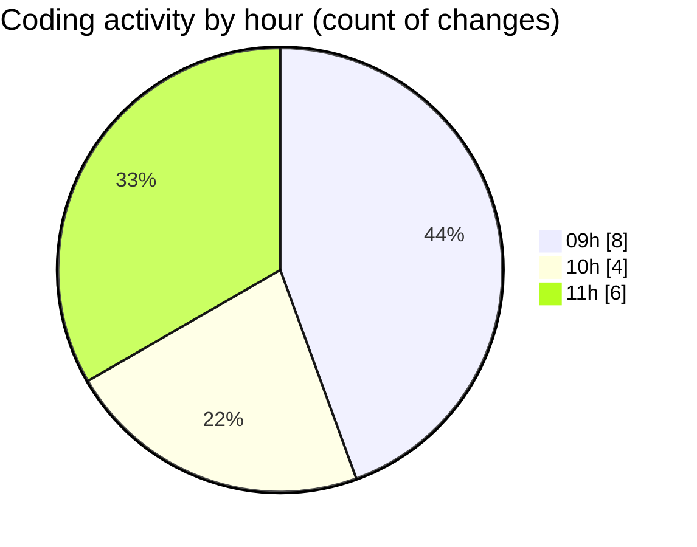

# CILApp - Activity Summary 

## Overall Statistics

| Stat                   | Value                                                             |
| ---------------------- | ----------------------------------------------------------------- |
| **Lines Added** (➕)   | 820                                          |
| **Lines Removed** (➖) | 426                                        |
| **Net Change** (↕)    | 394                |
| **Active Time** (⌚)   | 4 minutes |

## Modified Files
- **SeleccionVendedoresDC.java** (+266, -266)
- **ProcMonitorioToMASC.java** (+14, -14)
- **MascSmsService.java** (+2, -2)
- **PanelConsultaGeneralNew.java** (+144, -144)
- **ProcesoMarcajeCertificacion.java** (+294, -0)
- **keybindings.json** (+100, -0)

## Visualizations

### By File Type (Lines Changed)

### By Hour (Estimated Activity Count)

> **Last Updated:** 5/12/2026, 11:53:16 AM