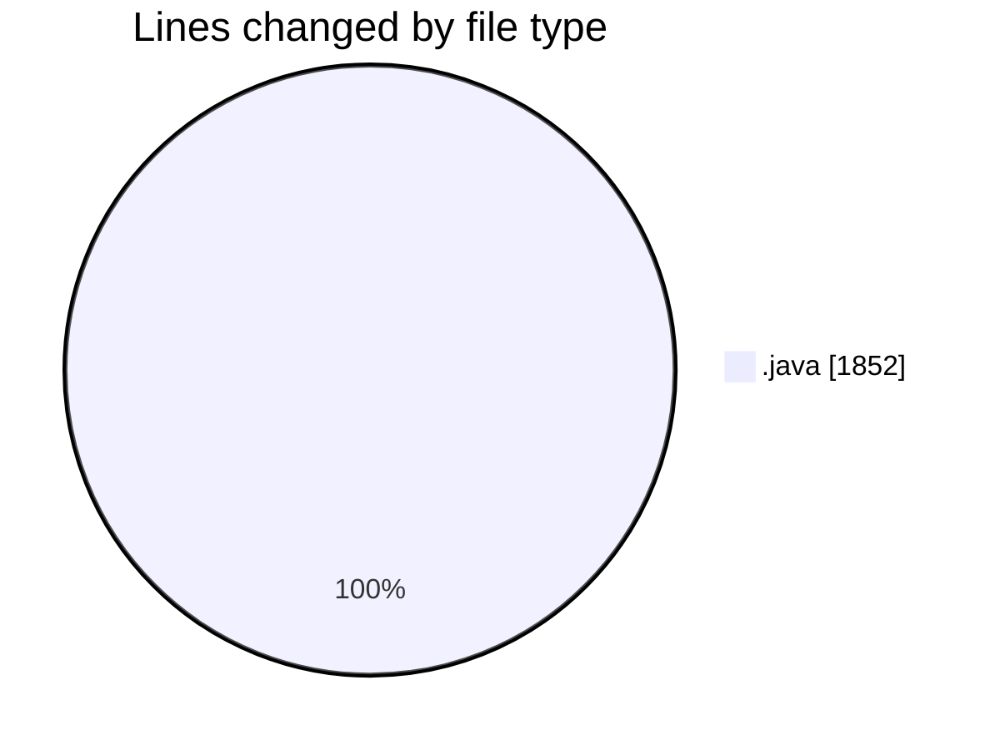

# CILApp - Activity Summary 

## Overall Statistics

| Stat                   | Value                                                             |
| ---------------------- | ----------------------------------------------------------------- |
| **Lines Added** (➕)   | 1380                                          |
| **Lines Removed** (➖) | 472                                        |
| **Net Change** (↕)    | 908                |
| **Active Time** (⌚)   | 0 minute |

## Modified Files
- **ProcMonitorioToMASC.java** (+465, -0)
- **PanelMantExpedientes.java** (+0, -267)
- **PanelConsultaGeneralNew.java** (+202, -72)
- **MascSmsService.java** (+573, -0)
- **SeleccionVendedoresDC.java** (+140, -133)

## Visualizations

### By File Type (Lines Changed)

### By Hour (Estimated Activity Count)

> **Last Updated:** 5/13/2026, 10:24:41 AM