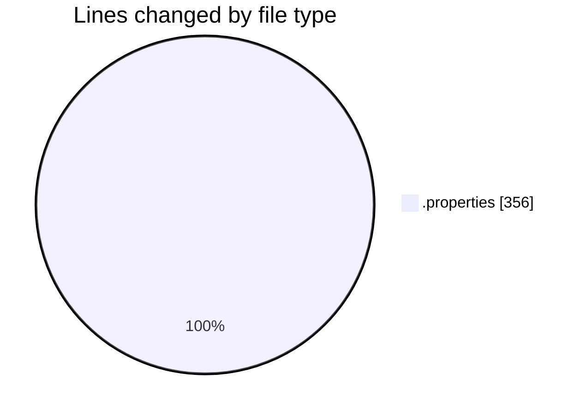
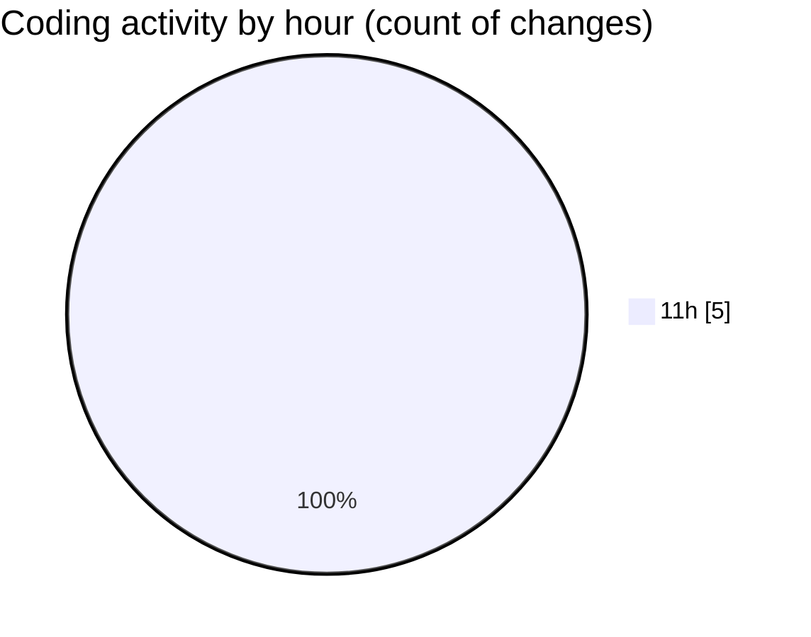

# CILReports (Workspace) - Activity Summary 

## Overall Statistics

| Stat                   | Value                                                             |
| ---------------------- | ----------------------------------------------------------------- |
| **Lines Added** (➕)   | 356                                          |
| **Lines Removed** (➖) | 0                                        |
| **Net Change** (↕)    | 356                |
| **Active Time** (⌚)   | 0 minute |

## Modified Files
- **Label_fr_FR.properties** (+92, -0)
- **Label_en_GB.properties** (+87, -0)
- **Label_de_DE.properties** (+83, -0)
- **Label_es_ES.properties** (+94, -0)

## Visualizations

### By File Type (Lines Changed)

### By Hour (Estimated Activity Count)

> **Last Updated:** 5/13/2026, 11:09:46 AM