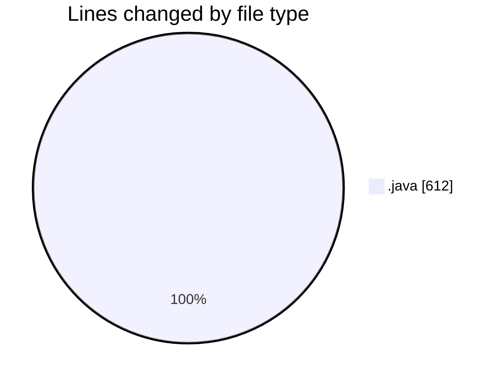
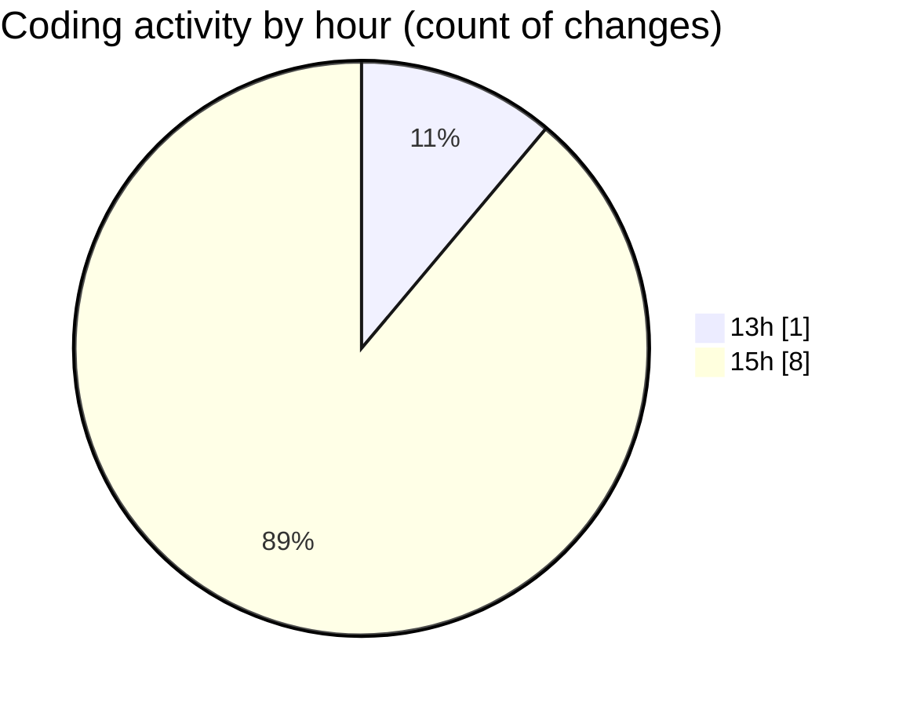

# CILApp - Activity Summary 

## Overall Statistics

| Stat                   | Value                                                             |
| ---------------------- | ----------------------------------------------------------------- |
| **Lines Added** (➕)   | 308                                          |
| **Lines Removed** (➖) | 304                                        |
| **Net Change** (↕)    | 4                |
| **Active Time** (⌚)   | 10 minutes |

## Modified Files
- **ProcMonitorioToMASC.java** (+53, -53)
- **PanelConsultaGeneralNew.java** (+117, -117)
- **MascSmsService.java** (+1, -1)
- **SeleccionVendedoresDC.java** (+133, -133)
- **Constantes.java** (+4, -0)

## Visualizations

### By File Type (Lines Changed)

### By Hour (Estimated Activity Count)

> **Last Updated:** 5/18/2026, 3:03:43 PM