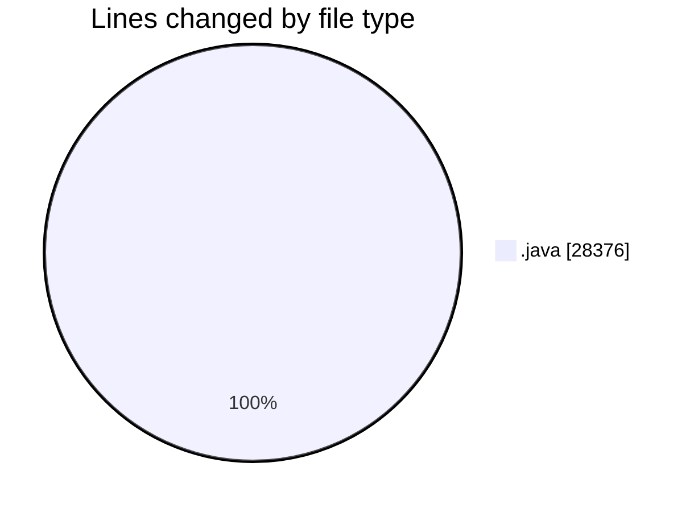
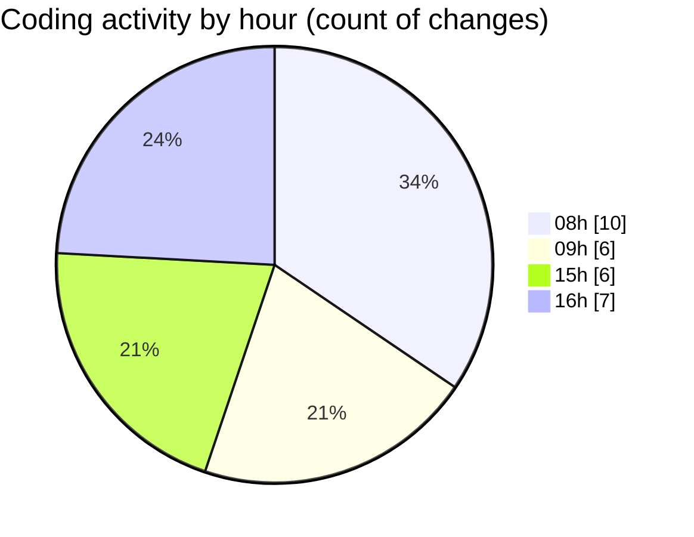

# CILApp - Activity Summary 

## Overall Statistics

| Stat                   | Value                                                             |
| ---------------------- | ----------------------------------------------------------------- |
| **Lines Added** (➕)   | 27394                                          |
| **Lines Removed** (➖) | 982                                        |
| **Net Change** (↕)    | 26412                |
| **Active Time** (⌚)   | 12 minutes |

## Modified Files
- **PanelEntradaPedidos.java** (+25353, -613)
- **PanelConsultaGeneralNew.java** (+117, -234)
- **MascSmsService.java** (+1, -2)
- **SeleccionVendedoresDC.java** (+266, -133)
- **IntroDatosAsesoriaAutomatico.java** (+1646, -0)
- **AjtTiposProced.java** (+11, -0)

## Visualizations

### By File Type (Lines Changed)

### By Hour (Estimated Activity Count)

> **Last Updated:** 5/19/2026, 4:20:15 PM