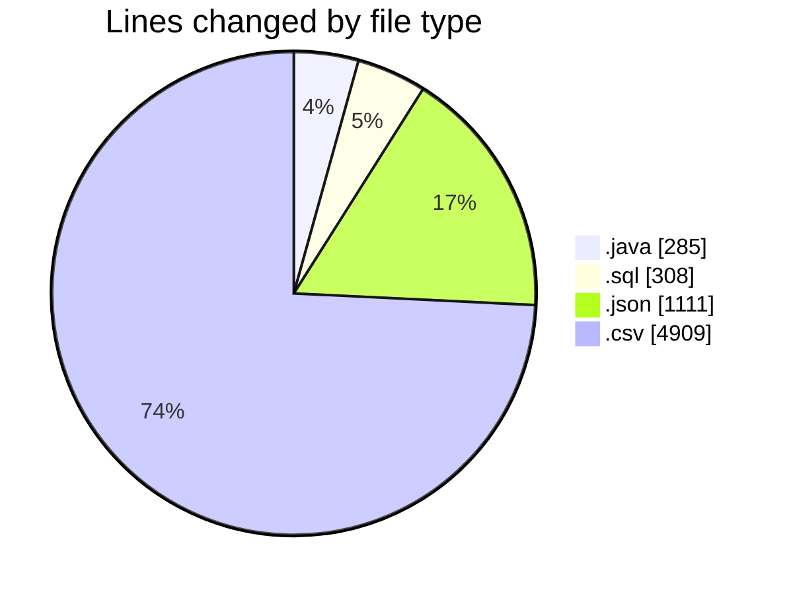
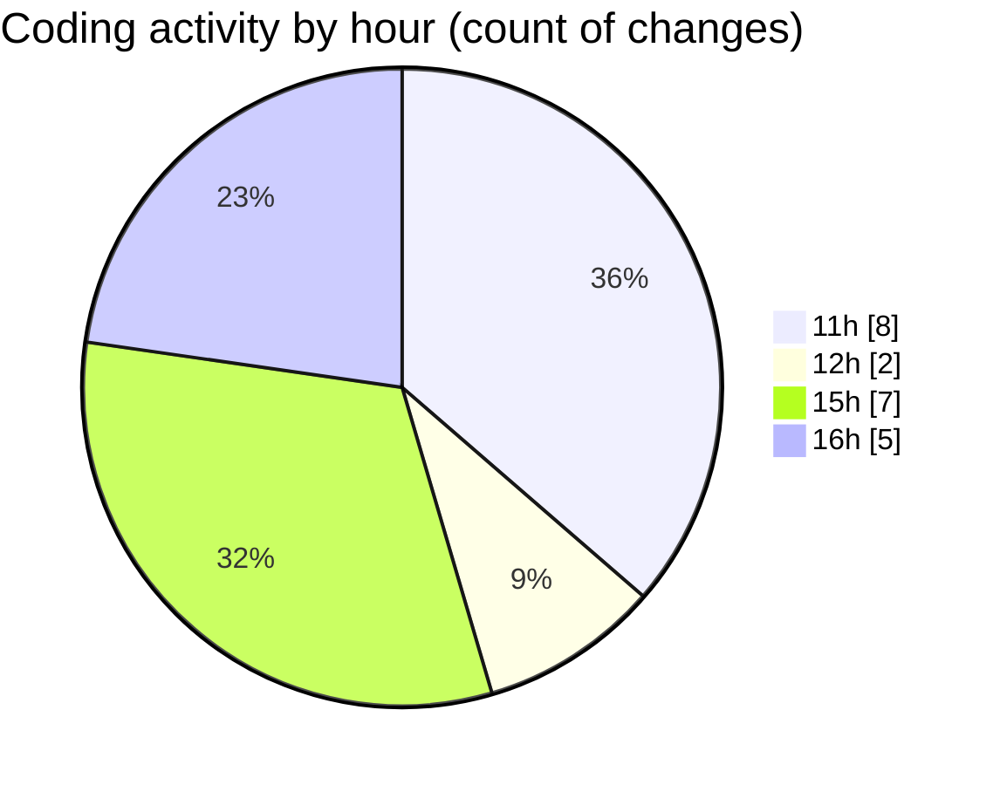

# CILApp - Activity Summary 

## Overall Statistics

| Stat                   | Value                                                             |
| ---------------------- | ----------------------------------------------------------------- |
| **Lines Added** (➕)   | 6610                                          |
| **Lines Removed** (➖) | 3                                        |
| **Net Change** (↕)    | 6607                |
| **Active Time** (⌚)   | 30 minutes |

## Modified Files
- **SQLExporterWhThreads.java** (+285, -0)
- **references_specs_de.sql** (+45, -0)
- **launch.json** (+1111, -0)
- **references_specs_de.sql** (+46, -1)
- **inventory_DE.sql** (+37, -1)
- **Inventory_DE.csv** (+2861, -0)
- **references_specs_de - copia.sql** (+44, -0)
- **references_specs_de - copia (2).sql** (+44, -0)
- **references_specs_CH.sql** (+45, -0)
- **references_specs_AT.sql** (+45, -0)
- **DatosReferencias.csv** (+2011, -0)
- **Helper.csv** (+28, -0)
- **Helper Inventory.csv** (+8, -1)

## Visualizations

### By File Type (Lines Changed)

### By Hour (Estimated Activity Count)

> **Last Updated:** 6/2/2026, 4:26:12 PM