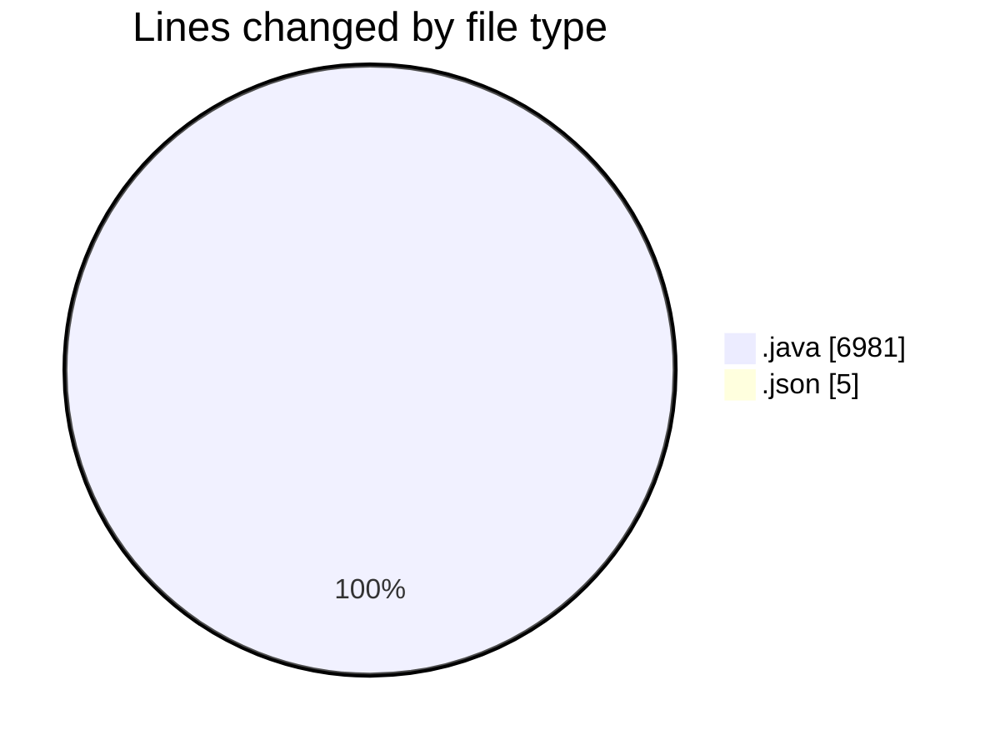
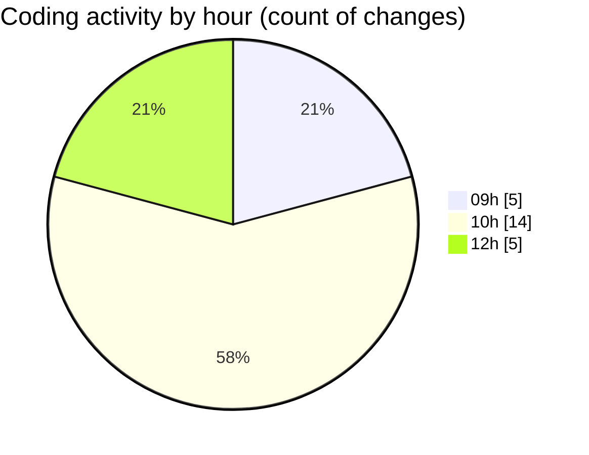

# CILApp - Activity Summary 

## Overall Statistics

| Stat                   | Value                                                             |
| ---------------------- | ----------------------------------------------------------------- |
| **Lines Added** (➕)   | 6775                                          |
| **Lines Removed** (➖) | 211                                        |
| **Net Change** (↕)    | 6564                |
| **Active Time** (⌚)   | 13 minutes |

## Modified Files
- **IntroDatosAsesoriaAutomatico.java** (+89, -178)
- **SeleccionVendedoresDC.java** (+3, -2)
- **OfertasComerciales.java** (+12, -18)
- **PanelCpPedidosMP.java** (+2647, -8)
- **PanelCpPedidosAC.java** (+2215, -2)
- **launch.json** (+2, -3)
- **PanelCpPedidosVP.java** (+1807, -0)

## Visualizations

### By File Type (Lines Changed)

### By Hour (Estimated Activity Count)

> **Last Updated:** 6/3/2026, 12:23:27 PM