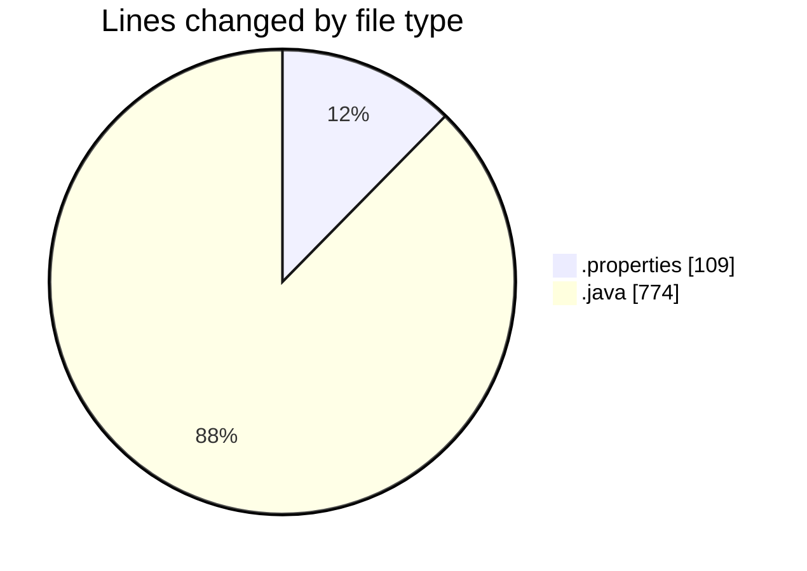
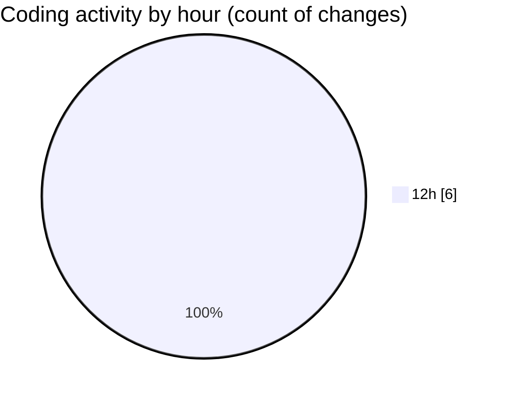

# CILReports (Workspace) - Activity Summary 

## Overall Statistics

| Stat                   | Value                                                             |
| ---------------------- | ----------------------------------------------------------------- |
| **Lines Added** (➕)   | 882                                          |
| **Lines Removed** (➖) | 1                                        |
| **Net Change** (↕)    | 881                |
| **Active Time** (⌚)   | 6 minutes |

## Modified Files
- **Label_es_ES.properties** (+94, -0)
- **Label_pt_PT.properties** (+15, -0)
- **JasperCobrosUtil.java** (+263, -0)
- **JasperCobrosRepository.java** (+510, -1)

## Visualizations

### By File Type (Lines Changed)

### By Hour (Estimated Activity Count)

> **Last Updated:** 6/9/2026, 12:54:17 PM