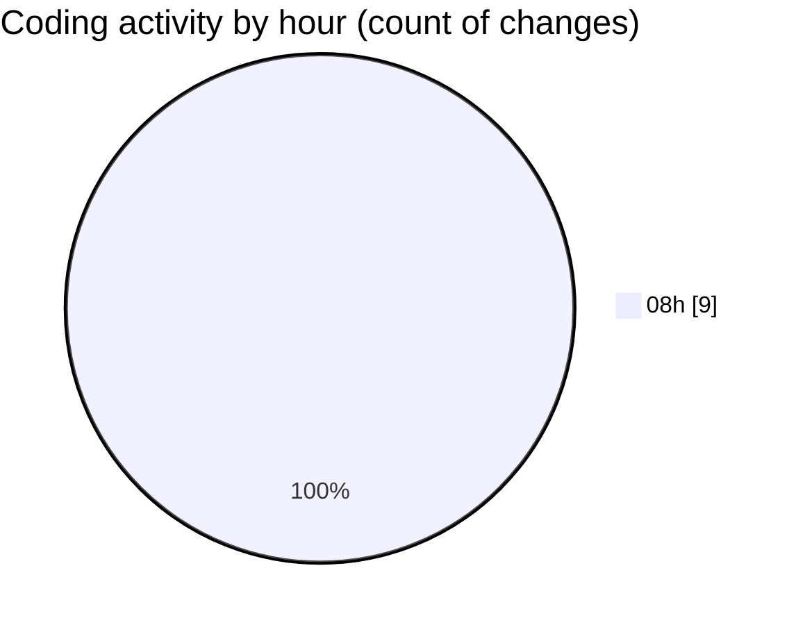

# CILReports (Workspace) - Activity Summary 

## Overall Statistics

| Stat                   | Value                                                             |
| ---------------------- | ----------------------------------------------------------------- |
| **Lines Added** (➕)   | 539                                          |
| **Lines Removed** (➖) | 28                                        |
| **Net Change** (↕)    | 511                |
| **Active Time** (⌚)   | 10 minutes |

## Modified Files
- **JasperCobrosRepository.java** (+20, -20)
- **RecobroRepository.java** (+511, -0)
- **JasperCobrosUtil.java** (+8, -8)

## Visualizations

### By File Type (Lines Changed)

### By Hour (Estimated Activity Count)

> **Last Updated:** 6/11/2026, 8:53:50 AM