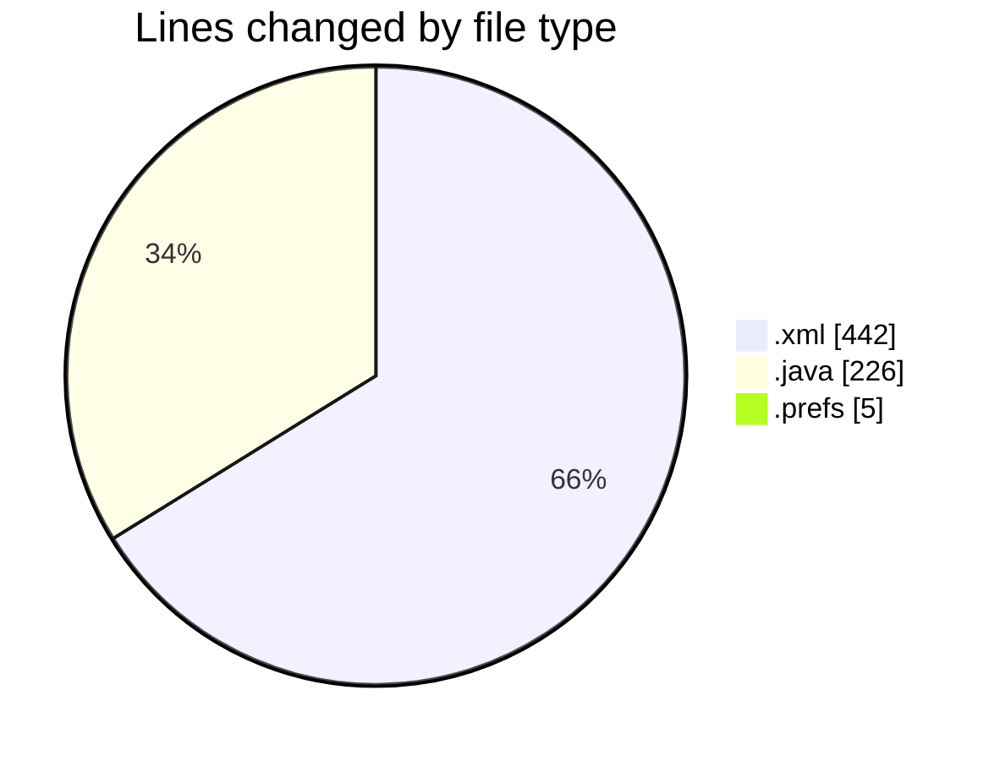
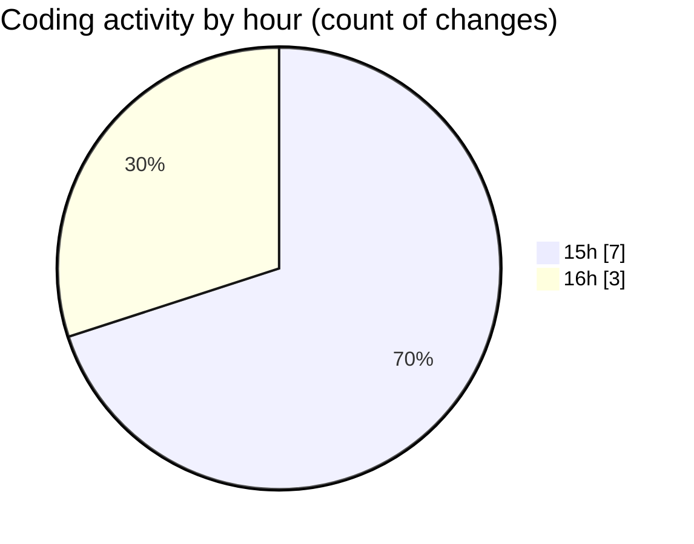

# CILReports (Workspace) - Activity Summary 

## Overall Statistics

| Stat                   | Value                                                             |
| ---------------------- | ----------------------------------------------------------------- |
| **Lines Added** (➕)   | 670                                          |
| **Lines Removed** (➖) | 3                                        |
| **Net Change** (↕)    | 667                |
| **Active Time** (⌚)   | 11 minutes |

## Modified Files
- **pom.xml** (+109, -1)
- **pom.xml** (+330, -2)
- **RecobroSqlQueries.java** (+226, -0)
- **org.eclipse.m2e.core.prefs** (+5, -0)

## Visualizations

### By File Type (Lines Changed)

### By Hour (Estimated Activity Count)

> **Last Updated:** 6/22/2026, 4:08:47 PM