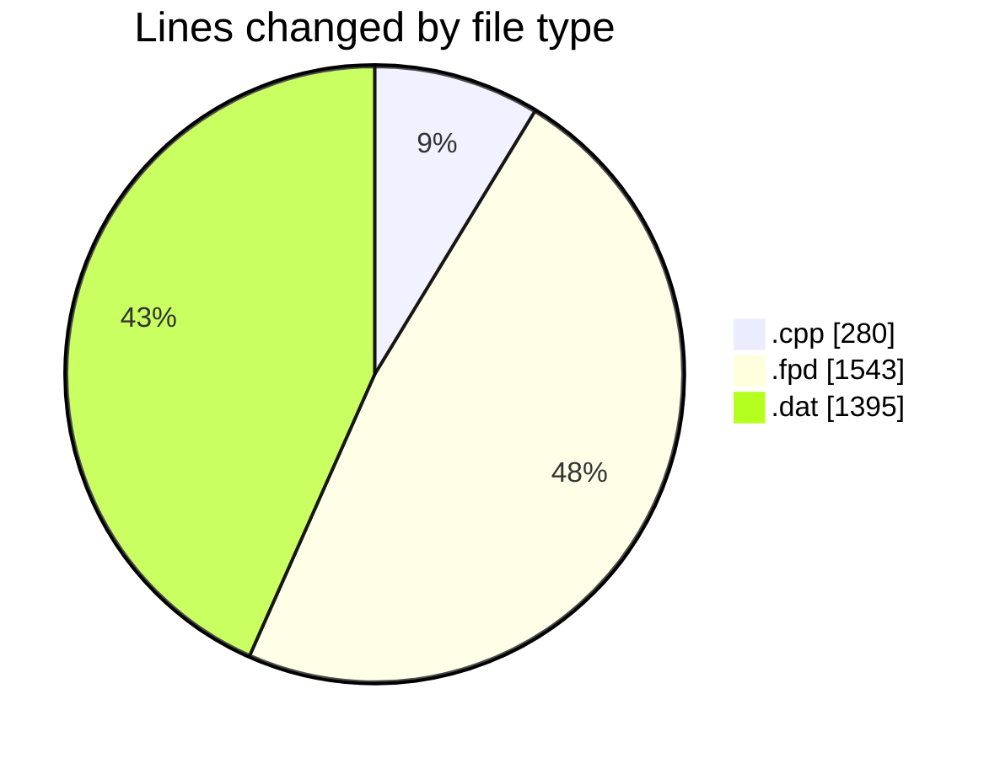
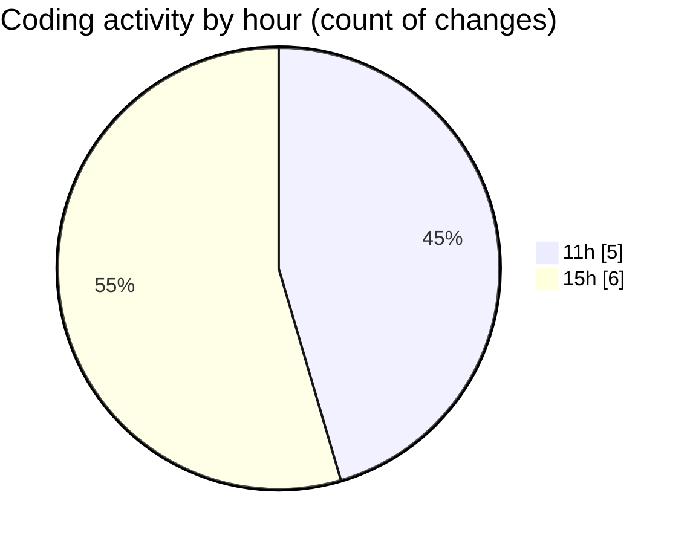

# CILApp - Activity Summary 

## Overall Statistics

| Stat                   | Value                                                             |
| ---------------------- | ----------------------------------------------------------------- |
| **Lines Added** (➕)   | 2055                                          |
| **Lines Removed** (➖) | 1163                                        |
| **Net Change** (↕)    | 892                |
| **Active Time** (⌚)   | 9 minutes |

## Modified Files
- **Event beginjob CartaAsesoriaINdividual.cpp** (+143, -0)
- **EventCode CartaAsesoriaIndividual.cpp** (+137, -0)
- **facturas_resto_2010-09-01.fpd** (+978, -565)
- **Cartas_Asesoria_Resto_SIN_procurador.dat** (+797, -598)

## Visualizations

### By File Type (Lines Changed)

### By Hour (Estimated Activity Count)

> **Last Updated:** 7/2/2026, 3:41:36 PM