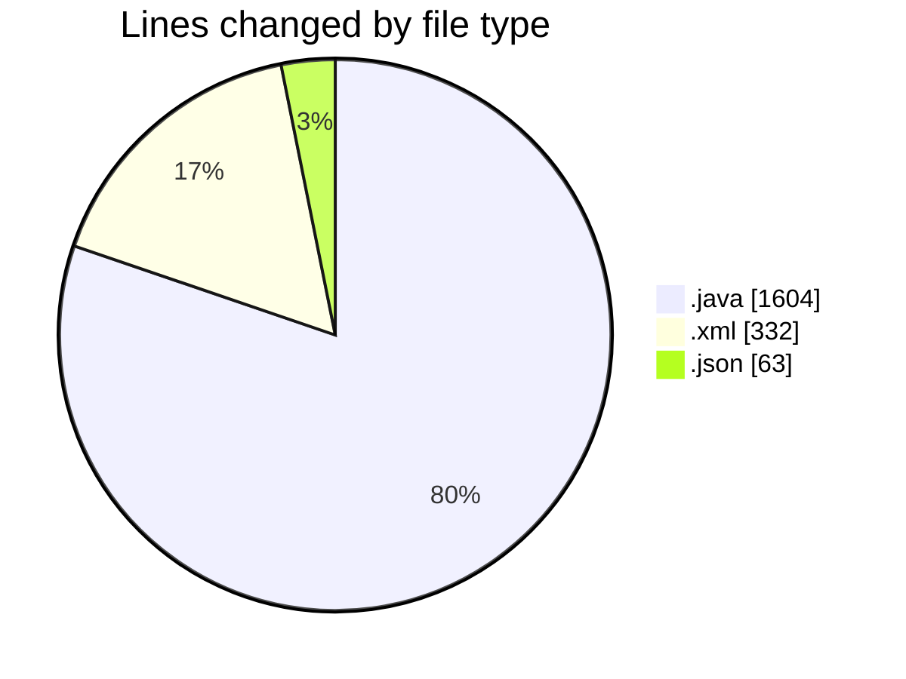
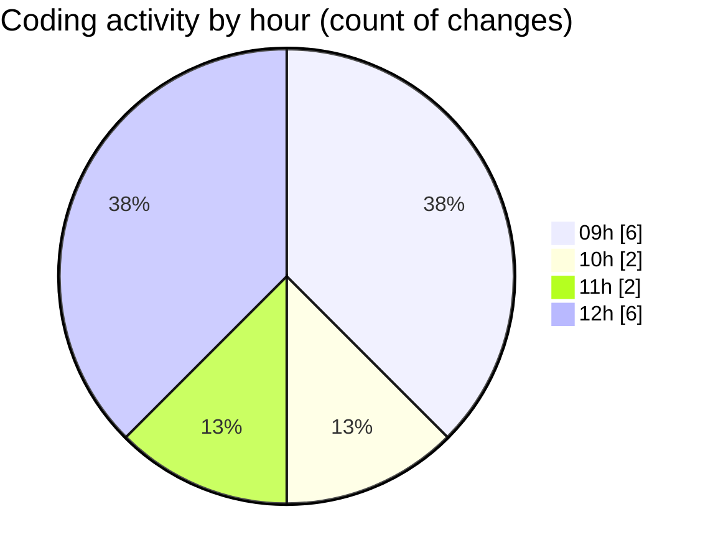

# CILReports (Workspace) - Activity Summary 

## Overall Statistics

| Stat                   | Value                                                             |
| ---------------------- | ----------------------------------------------------------------- |
| **Lines Added** (➕)   | 1773                                          |
| **Lines Removed** (➖) | 226                                        |
| **Net Change** (↕)    | 1547                |
| **Active Time** (⌚)   | 18 minutes |

## Modified Files
- **CILJasperFWebShop.java** (+650, -217)
- **pom.xml** (+330, -2)
- **launch.json** (+56, -7)
- **RecobroRepository.java** (+511, -0)
- **RecobroSqlQueries.java** (+226, -0)

## Visualizations

### By File Type (Lines Changed)

### By Hour (Estimated Activity Count)

> **Last Updated:** 7/7/2026, 12:41:57 PM