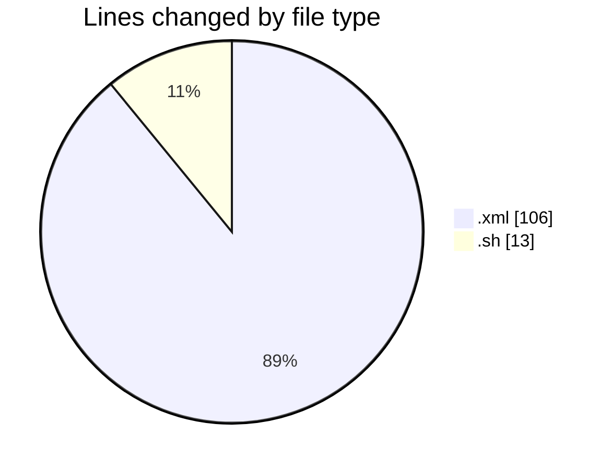
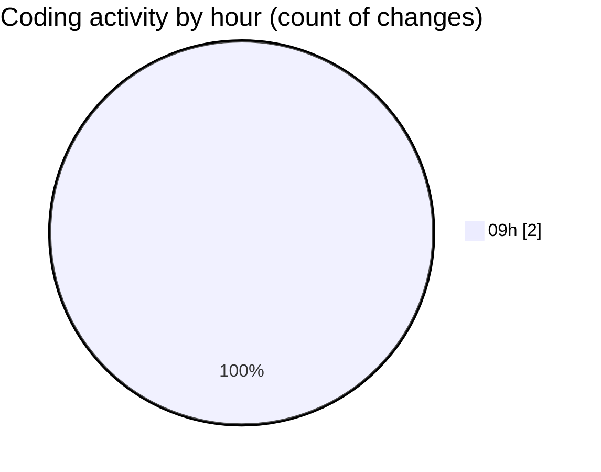

# Scripts - Activity Summary 

## Overall Statistics

| Stat                   | Value                                                             |
| ---------------------- | ----------------------------------------------------------------- |
| **Lines Added** (➕)   | 119                                          |
| **Lines Removed** (➖) | 0                                        |
| **Net Change** (↕)    | 119                |
| **Active Time** (⌚)   | 0 minute |

## Modified Files
- **FileZilla.xml** (+106, -0)
- **runSiglochWebShopDE.sh** (+13, -0)

## Visualizations

### By File Type (Lines Changed)

### By Hour (Estimated Activity Count)

> **Last Updated:** 7/7/2026, 9:51:53 AM